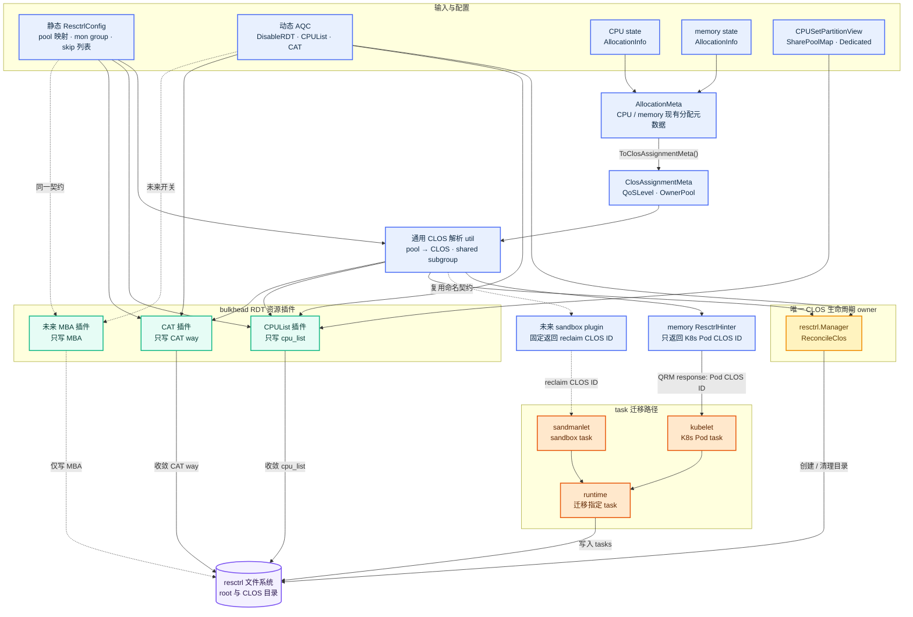
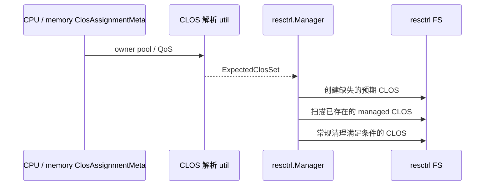
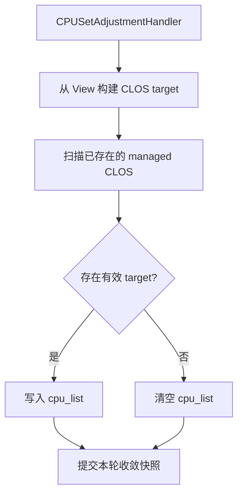
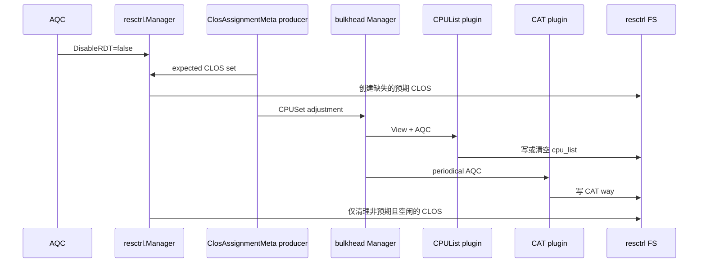
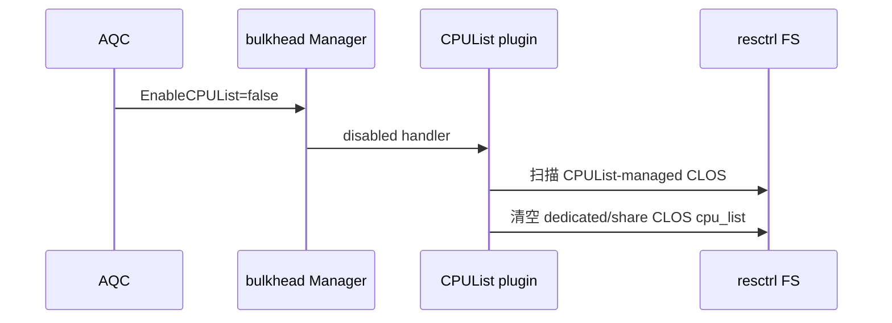
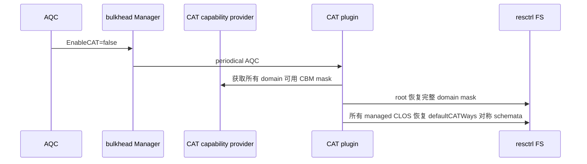
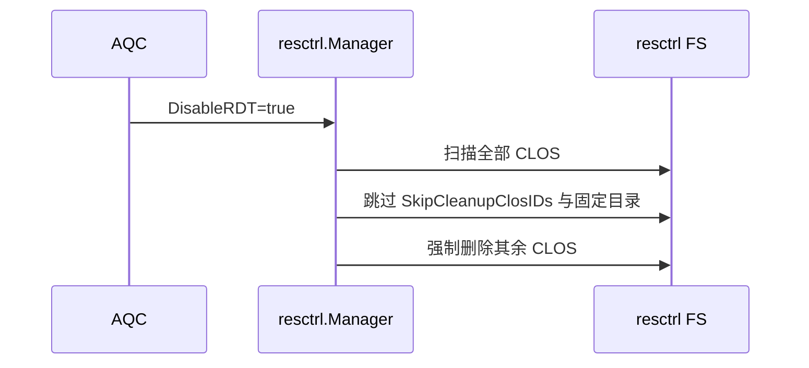

# RDT Bulkhead Resource Plugins 设计

## 背景与目标

当前 CPU bulkhead 已通过 `CPUSetAdjustmentHandler` 提供基于 CPU state 的同步收敛入口，并通过 AQC 支持插件级热启用、热禁用和禁用转换。内存 QRM 的 `resctrl.Manager` 已负责部分 resctrl 目录创建和清理，但其 CLOS 推导、清理判定和 RDT 资源写入仍未形成统一边界。

本设计将 RDT 控制面拆为一个独立的 CLOS 生命周期 owner 和多个按资源维度拆分的 bulkhead 插件：

- `resctrl.Manager` 是唯一创建、常规清理和 RDT 全局关闭清理 CLOS 的组件。
- `RDT CPUList` 插件只写入或清空 CLOS 的 `cpu_list`。
- `CAT` 插件只写入或回滚 CAT way。
- 未来 `MBA` 插件只写入或回滚 MBA，不复用 CAT 或 CPUList 的开关和回滚状态。

这样可以分别控制 CPU 关联、LLC cache way 和内存带宽资源，同时避免多个组件对同一 CLOS 目录做创建、删除或回收决策。

本期不实现 MBA 的具体配置策略，也不修改容器 task 到 CLOS 的分配方式。

## 术语和事实源

| 名称 | 定义 |
|---|---|
| CLOS | resctrl 下的服务类目录，例如 `dedicated`、`reclaim` 或 `share-30`；旧式 `shared-*` 仅作为兼容输入识别并归一化 |
| CLOS 生命周期 | CLOS 目录的同步/旁路创建、常规清理与 `DisableRDT` 强制撤销 |
| `DisableRDT` | AQC 中由 `resctrl.Manager` 消费的强制撤销开关；为 true 时删除 skip 以外全部 CLOS |
| CPUList 插件 | 仅收敛 CLOS `cpu_list` 的 bulkhead 插件 |
| CAT 插件 | 仅收敛 CLOS CAT way 的 bulkhead 插件 |
| pool | `ClosAssignmentMeta` 中的 owner pool，例如 `share`、特定 share pool、`dedicated`、`reclaim` |
| SharePoolMap | `CPUSetPartitionView` 中 `poolName -> CPUSet` 的精确映射 |
| DefaultClosIDs | `DisableRDT=false` 时 manager 默认确保存在、且常规清理不删除的 CLOS 集合；默认为空；`reclaim` 不再默认保活 |
| SkipCleanupClosIDs | 强制撤销和常规清理均保护的 CLOS 集合；不等同于资源插件写保护 |

CPU 与 memory state 中的 `AllocationInfo` 各自提供现有的 `AllocationMeta`；`AllocationMeta.ToClosAssignmentMeta()` 仅抽取 CLOS 解析所需的 `QoSLevel` 与 `OwnerPool`，形成独立的 `ClosAssignmentMeta`。后者才是 CLOS 归属和期望 CLOS 集合的唯一事实源。`CPUSetPartitionView` 是一次 CPUSetAdjustmentHandler 调用中由 CPU state 和拓扑导出的只读快照，只负责 CPUList 插件计算 `cpu_list`。CLOS 的目录、`tasks`、`cpu_list` 和 `mon_groups` 则是 resctrl 文件系统的现场事实。

## 设计原则

1. 一个资源文件只能有一个 bulkhead 插件 owner。CPUList、CAT 和未来 MBA 不互相写入对方资源。
2. 一个目录生命周期只能有一个 owner。只有 `resctrl.Manager` 能创建或删除 CLOS。
3. pool 到 CLOS 的转换必须复用同一纯函数 util；manager、CPUList 和 CAT 不得各自拼接 CLOS 名称。
4. 插件只操作目录已存在的 CLOS。目录缺失不是创建信号，而是本轮跳过并等待 manager 在后续循环创建。
5. 正常清理必须同时满足期望状态和文件系统状态，避免删除仍被 task、pod mon group 或 CPUList 占用的 CLOS。
6. `DisableRDT` 与资源插件开关独立。`DisableRDT=true` 时 manager 强制删除 `SkipCleanupClosIDs` 以外所有 CLOS，不检查 `tasks`、pod mon group 或 `cpu_list`，也不隐式改变 CAT 或 CPUList 配置语义。关闭资源插件不删除 CLOS。
7. RDT 收敛继续在 `DynamicPolicy.Lock` 内同步执行，保持 CPU state 更新和资源收敛的串行语义；CPUList/CAT 必须使用成功写入缓存跳过目标未变化的重复文件 I/O。

## 总体结构



`ClosAssignmentMeta` 是 CLOS 解析 util 的唯一输入模型，当前只包含 `QoSLevel` 与 `OwnerPool`。CPU 与 memory 的既有 `AllocationMeta` 提供 `ToClosAssignmentMeta()` util 完成转换；因此 CLOS util 不依赖任一 state 类型、也不继承 Pod UID、namespace、container 等 Kubernetes 专用字段。未来 sandbox plugin 直接构造 `ClosAssignmentMeta{QoSLevel: ..., OwnerPool: ...}`，无需伪造 `AllocationMeta`。

task 迁移分为两个互不重叠的对象域。memory `ResctrlHinter` 使用解析结果只向 kubelet 返回 Kubernetes Pod 的 CLOS ID；kubelet 将该 ID 交给 runtime，runtime 仅迁移对应 Pod 容器的 task。未来 `sandbox plugin` 不引入独立的 sandbox CLOS，而是固定向 sandmanlet 返回 `reclaim` CLOS ID；sandmanlet 通过 runtime 仅迁移对应 sandbox 的 task。二者可以复用 CLOS 命名契约，但不得处理对方对象域的 task。

manager 负责先创建目录，并且在清理前要求 `tasks` 为空；CPUList、CAT 和未来 MBA 插件从不直接迁移 task，只在目录存在后各自收敛资源文件。

### Sandbox CLOS 选择

第一版 sandbox 统一复用 `reclaim` CLOS：

| 项目 | 约定 |
|---|---|
| CLOS ID | 固定为 `reclaim` |
| 分配者 | 未来 sandbox plugin |
| 消费者 | sandmanlet，通过 runtime 迁移 sandbox task |
| `cpu_list` | CPUList 插件不为 `reclaim` 写入或推导 `cpu_list` |
| CAT / MBA | 可按 `reclaim` CLOS 配置收敛；不区分 Pod reclaim 与 sandbox reclaim |
| 生命周期 | `reclaim` 不再作为 `DefaultClosIDs` 默认创建；只有实际 state/admission/create 或显式 `DefaultClosIDs` 需要时才创建/保留，`DisableRDT=true` 时若未列入 skip 则强制删除 |

复用 `reclaim` 的收益是无需新增 CLOS 命名、CAT key 或 CPUList target，并使 sandbox 与 reclaimed workload 使用同一套低优先级资源策略。`resctrl.Manager` 不再通过默认 `DefaultClosIDs` 预先创建该目录；sandbox-only 节点若需要常驻 `reclaim`，应由实际 state/admission/create 或显式 `DefaultClosIDs` 触发。代价是二者共享同一个 resctrl 资源类：无法在第一版为 sandbox 与 Kubernetes reclaimed workload 设置不同的 CAT/MBA 值，也不能以 CLOS 为边界区分两类 task 的统计数据。

因此 sandbox plugin 的契约应固定为：只返回 `reclaim`，不得创建 `sandbox-*` CLOS，也不得覆盖 `reclaim` 的 CAT、MBA 或 `cpu_list`。将来若需要 sandbox 独立资源隔离，再通过显式的新 CLOS 类型和迁移兼容方案扩展，而不是复用同名 CLOS 写入不同策略。

## 共享 CLOS 解析 util

### 包职责

新增一个位于通用 util 层的纯逻辑包：

```text
pkg/util/resctrl
```

该包表达通用的 resctrl CLOS 命名、shared subgroup 格式化、pool 到 CLOS 的映射和 CAT key 解析，不得读写 resctrl 文件系统，不得依赖 memory dynamic policy、CPU bulkhead plugin 或具体 state 类型，也不得持有动态配置。CPU 与 memory 调用方通过 `AllocationMeta.ToClosAssignmentMeta()` 转换后传入该包；输出必须稳定、可排序、可去重。

### 核心数据结构

```go
type ClosAssignmentMeta struct {
    QoSLevel  string
    OwnerPool string
}

func SharedSubgroupClosID(subgroup int) string
func ResolveSharedPoolClosID(
    poolName string,
    config *qrmresctrl.ResctrlConfig,
) string
func ResolvePoolClosID(meta ClosAssignmentMeta, config *qrmresctrl.ResctrlConfig) (string, error)
func BuildExpectedClosPools(metas []ClosAssignmentMeta, config *qrmresctrl.ResctrlConfig) map[string][]string
func ResolveCATWayKey(key string, config *qrmresctrl.ResctrlConfig) string
```

`SharedSubgroupClosID` 是现有 memory `resctrl_hinter.go` 中 `getSharedSubgroup` 的唯一替代实现。现有 hinter、manager、CPUList 和 CAT 必须调用该函数，禁止继续在各自包内格式化 `share-<id>`。

`BuildExpectedClosPools` 直接返回 `map[string][]string`：key 为 CLOS ID，value 为归属该 CLOS 的 source pool 名称。多个 pool 可解析到同一 shared subgroup；此时 value 聚合全部 pool，CPUList 据此计算 CPUSet 并集，避免后写入的 pool 覆盖先前 CPUSet。

`ClosAssignmentMeta` 定义在 `pkg/util/resctrl`，避免通用 CLOS util 反向依赖 `commonstate`。现有 `commonstate.AllocationMeta` 增加以下转换方法：

```go
func (am AllocationMeta) ToClosAssignmentMeta() resctrl.ClosAssignmentMeta {
    return resctrl.ClosAssignmentMeta{
        QoSLevel:  am.QoSLevel,
        OwnerPool: am.OwnerPoolName,
    }
}
```

### 解析规则

| 输入 pool / QoS | 解析 CLOS | 说明 |
|---|---|---|
| share pool 且 `CPUSetPoolToSharedSubgroup[pool]` 存在 | `share-<id>` | 用配置 subgroup |
| share pool 且无显式映射 | `share-<DefaultSharedSubgroup>` | 与现有 `resctrl_hinter` 一致 |
| dedicated | `dedicated` | dedicated CPU 的稳定 CLOS |
| reclaim | `reclaim` | 生命周期和 CAT 可使用；CPUList 不写入 |
| system | `system` 或既有系统 pool 规则对应的稳定 CLOS | 本期不配置 CPUList target，但 util 保持类型能力 |

解析 util 还需提供以下函数：

```go
func IsManagedClosID(closID string, config *qrmresctrl.ResctrlConfig) bool
```

`ResolveCATWayKey` 的规则如下：

1. key 命中 `CPUSetPoolToSharedSubgroup` 时，返回映射后的 `share-<id>`。
2. key 未命中时，直接把 key 作为 CLOS ID。
3. 同时存在 pool key 和对应 CLOS ID 两条 CAT 配置时，CLOS ID 条目优先；配置校验必须记录冲突并拒绝模糊输入，或明确采用唯一稳定优先级。

设计选择：本期采用“直接 CLOS ID 优先，pool key 仅在未出现相同 CLOS 直接条目时生效”。该规则使运维可以为 CLOS 写精确覆盖，同时保留按 pool 配置的便利性。

## 通用 Resctrl 配置与 options

现有 `ResctrlConfig`、`ResctrlOptions`、命令行 flag 绑定及 shared subgroup 相关函数不能继续挂在 memory 插件下。CPU、memory、resctrl manager 和 bulkhead RDT 插件都需要同一配置模型。

静态配置重构为：

```text
pkg/config/agent/qrm/resctrl/resctrl_config.go
cmd/katalyst-agent/app/options/qrm/resctrl_options.go
pkg/util/resctrl/
```

`pkg/config/agent/qrm/resctrl.ResctrlConfig` 持有 `EnableResctrlHint`、`CPUSetPoolToSharedSubgroup`、`DefaultSharedSubgroup`、pod mon group 配置、`DefaultClosIDs` 和 `SkipCleanupClosIDs` 等静态字段。其定义、默认值、options 和 helper 不再属于 memory 目录；CPU bulkhead、memory hinter 与 `resctrl.Manager` 直接引用同一 `resctrl.ResctrlConfig`，消除跨插件复制配置的需求。

最终不在 `MemoryQRMPluginConfig` 中保留嵌入式 `ResctrlConfig`。配置对象由顶层 QRM 配置持有，例如 `Configuration.ResctrlConfig *resctrl.ResctrlConfig`；所有消费者通过显式依赖获取它。这样 memory policy 不再拥有 resctrl 配置，只在构造 `resctrlHinter` 时接收 `*resctrl.ResctrlConfig`，CPU bulkhead 的 CPUList/CAT 插件和 `resctrl.Manager` 也接收同一实例。

| 现有位置 | 迁移后位置 | 迁移内容 | 使用方 |
|---|---|---|---|
| `pkg/config/agent/qrm/memory_plugin.go` | `pkg/config/agent/qrm/resctrl/resctrl_config.go` | `ResctrlConfig` 改名为 `resctrl.ResctrlConfig`，含默认构造函数与配置校验 | manager、memory hinter、CPU bulkhead |
| `cmd/.../options/qrm/memory_plugin.go` | `cmd/.../options/qrm/resctrl_options.go` | `ResctrlOptions`、默认值、`AddFlags`、`ApplyTo` | agent 顶层 options |
| `memory/dynamicpolicy/resctrl_hinter.go` | `pkg/util/resctrl` 与 hinter 调用点 | `getSharedSubgroup`、`getSharedSubgroupByPool` 的通用解析部分 | hinter、manager、CPUList、CAT |

`resctrl.ResctrlConfig` 的静态字段按职责分组：

| 配置组 | 字段 | 语义 |
|---|---|---|
| Pod admission hint | `EnableResctrlHint`、`EnabledQoS` | 是否给 kubelet 返回 RDT CLOS hint，以及允许 hint 的 QoS |
| Shared CLOS 映射 | `CPUSetPoolToSharedSubgroup`、`DefaultSharedSubgroup` | shared pool 到 `share-<id>` CLOS 的唯一映射来源 |
| Mon group | `MonGroupEnabledClosIDs`、`MonGroupMaxCountRatio` | pod 级监控组创建策略和容量上限 |
| 默认 CLOS | `DefaultClosIDs` | 常规模式默认创建并常驻的 CLOS；默认值为空；如需常驻 `reclaim` 需显式配置 |
| 生命周期保护 | `SkipCleanupClosIDs` | 常规清理和 `DisableRDT` 强制撤销都不删除的 CLOS 目录 |

`EnableResctrlGroupLifecycleManagement` 被 `DisableRDT` 动态开关取代，不再作为 memory 静态开关保留。命令行兼容策略由实现阶段确认：若必须保留旧 flag，仅作为启动时初始值；不得形成第二个 CLOS 清理 owner。

迁移后的配置装配顺序如下：

1. `NewResctrlOptions` 创建独立默认值：`DefaultSharedSubgroup=-1`、`EnabledQoS=[shared_cores]`、`DefaultClosIDs=[]`，其余集合为空。
2. agent 顶层 `AddFlags` 调用 `ResctrlOptions.AddFlags`，保留既有 `resctrl-*` flag 名称，避免部署参数破坏。
3. `ResctrlOptions.ApplyTo(configuration.ResctrlConfig)` 构造静态通用配置。
4. memory policy 从顶层配置取 `*resctrl.ResctrlConfig` 创建 hinter；CPU dynamic policy 从同一配置读取 shared CLOS 映射；manager 使用该配置读取 skip 列表、mon group 和解析参数。
5. AQC 只覆盖动态字段：通用 `RDTConfig.DisableRDT` 与 bulkhead `BulkheadRDTConfig`；它不修改静态 pool 映射、mon group 策略或 skip 列表。

依赖方向必须保持为：

```text
options/qrm/resctrl_options -> config/agent/qrm/resctrl
util/resctrl ----------------> config/agent/qrm/resctrl
memory dynamicpolicy --------> config/agent/qrm/resctrl, util/resctrl
cpu bulkhead ----------------> config/agent/qrm/resctrl, util/resctrl
memory resctrl.Manager ------> config/agent/qrm/resctrl, util/resctrl
```

通用 resctrl 包可以依赖静态 `ResctrlConfig`，但不得反向导入 CPU、memory、bulkhead 或 dynamicpolicy 包。

## AQC 配置模型

RDT 强制撤销与 bulkhead RDT 资源插件使用两层动态配置。强制撤销归属通用 QRM 配置；资源插件开关和资源参数归属 CPU bulkhead 配置。API 在 `katalyst-api/pkg/apis/config/v1alpha1/adminqos.go` 的 `QRMPluginConfig` 增加 `RDTConfig`，且该配置只包含 `DisableRDT`；API 的 `CPUPluginConfig.BulkheadConfig` 增加 `BulkheadRDTConfig`。core 分别在通用 dynamic QRM 配置层和 dynamic CPU bulkhead 配置层应用对应字段。

```go
type RDTConfig struct {
    DisableRDT *bool
}

type BulkheadRDTConfig struct {
    EnableCPUList   *bool
    EnableCAT       *bool
    DefaultCATWays  *int64
    ClosCATWays     map[string]int64
}
```

| 配置 | Owner | 含义 |
|---|---|---|
| `QRMPluginConfig.RDTConfig.DisableRDT` | `resctrl.Manager` | `false` 时按期望集合创建与常规清理；`true` 时强制删除 skip 以外全部 CLOS |
| `CPUPluginConfig.BulkheadConfig.BulkheadRDTConfig.EnableCPUList` | CPUList bulkhead 插件 | 热启用/禁用 `cpu_list` 收敛 |
| `CPUPluginConfig.BulkheadConfig.BulkheadRDTConfig.EnableCAT` | CAT bulkhead 插件 | 热启用/禁用 CAT way 收敛 |
| `CPUPluginConfig.BulkheadConfig.BulkheadRDTConfig.DefaultCATWays` | CAT bulkhead 插件 | non-root CLOS 的默认/回滚 CAT way；root 始终使用完整可用 mask |
| `CPUPluginConfig.BulkheadConfig.BulkheadRDTConfig.ClosCATWays` | CAT bulkhead 插件 | pool name 或 CLOS ID 到 CAT way 的映射 |

API 字段、deepcopy 和 CRD 生成文件必须在独立 `katalyst-api` worktree 修改。core worktree 只消费 API 生成结果。该约束避免 core 与 API 的依赖边界被同一分支的临时改动污染。

## resctrl Manager 生命周期

### DisableRDT 强制撤销

`DisableRDT` 是唯一的 AQC RDT 全局开关，`resctrl.Manager` 是唯一消费者。它不定义 draining 状态，也不触发 task 回迁：该字段表达的是强制撤销目录的运维动作。

| `DisableRDT` | manager 行为 | `Create` / `ReconcileClos` | `ResctrlHinter` / sandbox plugin |
|---|---|---|---|
| `false` | 创建 `DefaultClosIDs` 与期望集合中的缺失 CLOS，并按常规保护条件清理空闲非默认 CLOS | 可创建；常规清理仍检查 `tasks`、pod mon group、`cpu_list`，且不删除默认 CLOS | 保持既有 CLOS ID 返回语义 |
| `true` | 删除 `SkipCleanupClosIDs` 之外所有 CLOS | 禁止创建；`ReconcileClos` 忽略期望集合并执行强制删除 | 不在本期改变其既有行为 |

强制删除不检查 `tasks`、pod mon group 或 `cpu_list` 是否为空。root、`info`、`mon_data` 和顶层 `mon_groups` 是 resctrl 固定对象，不属于可删 CLOS。`DisableRDT=false` 后，后续 `Create` 或 `ReconcileClos` 可以重新创建所需目录。

### 期望集合

manager 使用 CPU 与 memory state 的 `AllocationMeta.ToClosAssignmentMeta()` 结果构建动态期望集合。`DisableRDT=false` 时，再将静态 `DefaultClosIDs` 合并为最终 `ExpectedClosSet`；`reclaim` 不再因静态默认值自动创建；只有 state、admission/create 或显式 DefaultClosIDs 需要时才创建/保留。最终集合显式合并：

- `DefaultClosIDs`，仅在 `DisableRDT=false` 时
- 当前 state 解析出的所有 CLOS
- 仍有活动 pod mon group 或非空 `tasks` 的现场组

`DefaultClosIDs` 与 `SkipCleanupClosIDs` 语义不同：默认 CLOS 只在常规模式创建和保活，`DisableRDT=true` 时仍会被删除；skip CLOS 在常规清理和强制撤销中都受保护。二者都由 `resctrl.Manager` 所持有的静态 `resctrl.ResctrlConfig` 读取，不由 state 推导。

### 常规模式：`DisableRDT=false`



常规清理一个 managed CLOS 前，manager 必须同时确认：

1. CLOS 不在 `ExpectedClosSet`，包括 `DefaultClosIDs`。
2. CLOS 不在 `SkipCleanupClosIDs`。
3. `tasks` 为空。
4. 不存在活动 pod mon group。
5. `cpu_list` 为空。

第五条是本期新增的保护条件。它保证 CPUList 插件仍显式绑定 CPU 的 CLOS 不会因为 state 和 manager 周期短暂错位被删除。

### 强制撤销：`DisableRDT=true`

`DisableRDT=true` 时，manager 忽略 `ExpectedClosSet`，遍历 resctrl 根目录并删除 `SkipCleanupClosIDs` 之外的全部 CLOS。删除前不检查 `tasks`、pod mon group 或 `cpu_list`；强制删除会使其中 task 脱离原 CLOS，这正是该开关的语义。`SkipCleanupClosIDs`、root、`info`、`mon_data` 和顶层 `mon_groups` 始终保留。

### 与现有 manager 的改动

`ReconcileClos` 是旁路周期收敛入口：它补建 state 已声明但尚不存在的期望 CLOS，并回收不再需要的空闲 CLOS。`Create` 是 admission 同步入口：它在 Pod admission 返回 CLOS ID 前按需创建该 CLOS，并创建对应 pod mon group。二者都可创建目录，但触发时机和职责不同，不冲突；它们必须复用同一个 manager 串行保护和目录创建 helper，避免并发创建产生不一致。

接口需要将 state 推导结果作为 `ReconcileClos` 输入，避免仅以 active pod UID 做目录回收判断：

```go
type ClosReconcileState struct {
    ExpectedClosIDs sets.String
    ActivePodUIDs   sets.String
    DisableRDT      bool
}

type Manager interface {
    Run(stopCh <-chan struct{})
    ReconcileClos(ctx context.Context, state ClosReconcileState) error
    Create(podUID, closID string, createMonGroup bool) error
    GetMonGroupsCount() (int64, error)
}
```

`ReconcileClos` 接收随 state/AQC 变化的期望 CLOS、活动 pod UID 和 `DisableRDT`。实现从 `m.config.SkipCleanupClosIDs` 读取保护名单，与当前 `Cleanup` 的配置读取方式保持一致。`DisableRDT=true` 时，它不使用期望集合，直接执行强制删除。`Create` 在 admission 同步路径按需确保 CLOS 与 pod mon group 存在；当 `DisableRDT=true` 时必须拒绝创建。它不做全局扫描、stale 判断或删除。

## CPUList bulkhead 插件

### 职责

插件目录建议为：

```text
pkg/agent/qrm-plugins/cpu/dynamicpolicy/bulkhead/plugins/rdt/cpulist
```

CPUList 插件在 `CPUSetAdjustmentHandler` 中只读 `HandlerContext.View` 和动态配置。它收敛已存在的 CPUList-managed CLOS；当本轮存在非空 target 但对应 CLOS 尚未创建时，`ApplyCPUList` 可在 per-CLOS 操作锁内按需创建该 CLOS 并写入 `cpu_list`，用于消除 memory `resctrl.Manager` 周期创建延迟。它不删除或重命名目录，也不为空 target 创建新 CLOS。

### 成功写入缓存

CPUList 在 `DynamicPolicy.Lock` 内同步运行，因此必须将实际文件 I/O 限定为“目标变化”时才执行。插件维护仅在成功写入后更新的缓存：

```go
type CPUListCacheKey struct {
    ClosID   string
    ClosEpoch uint64
}

type CPUListAppliedTarget struct {
    CPUSet string // machine.CPUSet.String() 的规范化结果；空串表示已成功清空
}
```

`ClosEpoch` 是 CPU 侧 `CPUListManager` 根据 CLOS 目录文件身份维护的目录实例版本。CPUList 以 `(ClosID, ClosEpoch)` 查找缓存；同名 CLOS 被删除后重新创建时，文件身份变化会使 epoch 变化，旧缓存不会命中。memory `resctrl.Manager` 不暴露 `ClosEpoch`，只负责 CLOS 生命周期和资源缓存失效通知。

每次 handler 仍必须扫描当前受管目录并计算完整 target，但对每个目录按下列规则处理：

1. 目录不存在且 target 为空：删除该 CLOS 的缓存项，不创建目录。
2. 目录不存在且 target 非空：在共享 per-CLOS 操作锁内创建 CLOS，再写 `cpu_list`。
3. 缓存不存在、`ClosEpoch` 不同，或规范化 target 与缓存值不同：写 `cpu_list`。
4. 写成功后更新缓存；写失败不更新缓存，下一轮重试。
5. 缓存命中且 target 相同：跳过写入，记录 `skipped_unchanged` 指标。

首次启用、agent 重启、插件从 disabled 切换到 enabled、`DisableRDT` 从 true 切回 false，或 manager 报告目录版本变化时，缓存均视为未命中。CPUList disabled handler 不使用正常缓存：它必须执行一次全量清空语义，成功后将对应项缓存为“空 target”。

### CPUSet target 构建

| CLOS 类型 | target |
|---|---|
| shared CLOS | 所有解析到该 CLOS 的 `View.SharePoolMap[poolName]` 的并集 |
| dedicated CLOS | `View.Dedicated` |
| reclaim CLOS | 不写 `cpu_list` |
| root CLOS | 不写 `cpu_list` |
| system CLOS | 本期不写 `cpu_list` |

shared CLOS 必须通过绑定中保存的 `SourcePool` 查找 `SharePoolMap`。缺失 pool 视为该 CLOS 本轮没有有效 target，不得回退到 `SharePool` 汇总集合。

`buildTargets` 只为非空 CPUSet 生成显式 target。空 CPUSet 不进入 target map；已存在 CLOS 没有显式 target 时，由启用流程将其 `cpu_list` 清空。这样非空 target 才会触发缺失 CLOS 的按需创建，空 target 不会创建新目录。

### 启用流程



启用状态下插件还承担 stale `cpu_list` 清理：

- 已存在 shared CLOS 若没有任何当前 `SharePoolMap` pool 映射到它，清空 `cpu_list`。
- 已存在 dedicated CLOS 若 `View.Dedicated` 为空，清空 `cpu_list`。
- reclaim CLOS 不因本插件写入 CPUSet；CPUList 只写 `dedicated` 与 shared CLOS，不负责清空 `reclaim` / `system` / 其它默认 CLOS 的 `cpu_list`。
- `SkipCleanupClosIDs` 不阻止启用路径清空 stale `cpu_list`；该名单只阻止 manager 删除目录。

为了满足“开启时清理 View.SharePoolMap 对应 pool 不存在的 CLOS 的 `cpu_list`”，扫描范围必须是所有已存在的 Katalyst managed CLOS，而不是只扫描本轮 target。

### 禁用回滚

禁用转换时：

1. 扫描所有已存在的 CPUList-managed CLOS；跳过 resctrl 固定目录。
2. 仅清空 `dedicated` 与 shared CLOS 的 `cpu_list`。
3. 不使用 `SkipCleanupClosIDs` 作为写保护；该名单只保护 manager 删除目录。
4. 不写 CAT way，不删除 CLOS，不修改 task 或 mon group。

CPUList 不依赖“上一次成功 target 快照”限定禁用范围。禁用时全量扫描 CPUList-managed CLOS，清理重启前遗留的 dedicated/shared `cpu_list`；`reclaim`、`system`、显式默认 CLOS 和未知外部 CLOS 不属于 CPUList 写入对象。

## CAT bulkhead 插件

### 职责和 target

插件目录建议为：

```text
pkg/agent/qrm-plugins/cpu/dynamicpolicy/bulkhead/plugins/rdt/cat
```

CAT 插件只操作已存在的 CLOS 的 CAT way。它不读写 `cpu_list`，不创建和删除 CLOS。

### CAT target 缓存

CAT 的资源写入缓存放在 `RDTManager`/`SchemataCoordinator` 内，而不是 CAT 插件内。这样现有 MB allocator、未来 MBA 和 CAT 共享同一个 per-CLOS 操作锁时，只有 coordinator 能决定 L3 行是否已经处于目标状态。CAT 插件不追踪 CLOS epoch；CLOS 创建、删除、强制撤销和 CPUList 按需创建导致的 lifecycle 变化，均由 `RunClosLifecycle` / `RunClosResourceUpdate` 在释放 per-CLOS 锁前使 coordinator 缓存失效。

```go
type AppliedL3Target struct {
    Domains map[int]CBMMask // 按 domain ID 排序、规范化后的 L3 target
}
```

`ApplyCAT` 接收 CLOS ID 和完整对称 L3 target。若该 CLOS 的缓存命中且每个 domain 的 L3 mask 与请求目标一致，则 coordinator 不读写 `schemata`，返回 `skipped_unchanged`。缓存只在 read-modify-write 成功后更新；更新 `MB:` 行不能使 L3 缓存失效，因为 coordinator 保留 L3 行。删除、重建、强制撤销和 L3 写失败均使该 CLOS 的 CAT 缓存失效。

缓存不替代 coordinator 的文件正确性职责：agent 重启或 lifecycle/resource update 触发缓存失效时，coordinator 必须读取完整 `schemata` 并执行 L3 行 read-modify-write。若未来允许 Katalyst 外部组件直接修改 `L3:` 行，则该组件必须通过 `RDTManager`，或显式调用 `InvalidateClos(closID)`；否则不保证缓存命中时会修复越权外部改动。

### 对称 cache-domain 策略

本设计采用对称 CAT 策略：同一 CLOS 的一个 CAT way 数在所有 cache domain 中相同，不支持按 NUMA、L3 或 cache domain 配置不同 way 数。`defaultCATWays` 与 `closCATWays` 都是“每个 domain 使用的 way 数”，而非单一 domain 的 mask。

CAT capability provider 在初始化时读取每个 cache domain 的 CBM mask、可用 way 数与最小连续 bit 数。对于一个合法的 `N` way 配置，CAT 插件在每个 domain 从该 domain 的可用 CBM mask 派生相同 `N` 个连续 way 的 mask；不同 domain 的物理 bit 位置可以不同，但 way 数、选择方向和 mask 生成算法必须相同。root 使用其完整可用 mask，不因 `defaultCATWays` 被缩窄。

若任一 cache domain 无法满足 `N`（例如 `N` 小于最小 CBM bits 或大于该 domain 可用 way 数），整轮 CAT 配置无效，禁止向任何 domain 部分写入。这样保持“全 domain 对称”与多 domain 硬件能力差异兼容。

target 构建顺序：

1. 读取 CAT capability provider，验证所有 cache domain 的可用能力。
2. 读取 `defaultCATWays`，作为非 root CLOS 的未显式配置回滚 way 数；root 始终保留完整可用 mask。
3. 对 `closCATWays` 逐项调用 `ResolveCATWayKey`，得到目标 CLOS。
4. 对同一 CLOS 的多条结果执行冲突校验；冲突时整个本轮失败，不执行部分 CAT 写入。
5. 为每个 CLOS 生成覆盖全部 cache domain 的对称 L3 target，并通过 `RDTManager` 更新 `schemata` 的 L3 行。
6. 仅向文件系统中实际存在的 CLOS 写入 CAT way；缺失目录记录可观测指标并跳过。

CAT 配置中的 key 允许写 pool name 或 CLOS ID：

```yaml
closCATWays:
  gpu-batch: 14       # 若 gpu-batch 映射到 subgroup 30，则写 share-30
  dedicated: 14       # 不在 shared pool 映射中，直接写 dedicated
  reclaim: 1          # 直接写 reclaim；不触发 cpu_list 写入
```

### 禁用回滚

CAT 禁用转换时：

- root 恢复完整可用 CBM mask。
- 扫描所有已存在的 managed non-root CLOS，并将每个 cache domain 的 CAT way 恢复为 `defaultCATWays` 对应的对称 `schemata`。
- 不受 `SkipCleanupClosIDs` 限制；该名单只保护目录，不保护 CAT 配置。
- 不写 `cpu_list`，不删除 CLOS。

全量扫描而不是仅回滚上次成功的 CLOS 集合，保证 agent 重启后关闭 CAT 仍能清除遗留 CAT 配置。

### RDTManager 与 SchemataCoordinator

`schemata` 是 CAT 的 `L3:` 行与现有 MB/MBA 的 `MB:` 行共享的内核文件，不能再由任何插件或 allocator 直接覆盖写入。`RDTManager` 是唯一的 `schemata` 文件访问入口，并在内部采用 `SchemataCoordinator` 完成按资源行的 read-modify-write。非 `schemata` 的 CLOS 资源写入（例如 `cpu_list`）也必须通过 `RDTManager.RunClosResourceUpdate` 进入同一 per-CLOS 操作锁，避免与 CLOS 创建/删除交错。

```go
type RDTManager interface {
    CheckSupportRDT() (bool, error)
    InitRDT() error
    ApplyTasks(clos string, tasks []string) error

    // 仅更新 schemata 的 L3 行，保留 MB 和未知资源行。
    ApplyCAT(clos string, l3 map[int]CBMMask) error
    // 仅更新 schemata 的 MB 行，保留 L3 和未知资源行。
    ApplyMBA(clos string, mba map[int]int) error
    // 串行化非 schemata 的 CLOS 资源文件写入，例如 cpu_list。
    // update 返回 changed=true 表示本次资源更新同时改变了 CLOS lifecycle
    // 状态，coordinator 需要在释放锁前失效该 CLOS 的缓存；即使
    // update 返回错误，也必须先按 changed 失效缓存。
    RunClosResourceUpdate(clos string, update func() (changed bool, err error)) error
    // CLOS 目录创建、删除或强制撤销后使缓存失效。
    InvalidateClos(clos string)
}

type SchemataCoordinator interface {
    ApplyL3(clos string, l3 map[int]CBMMask) error
    ApplyMB(clos string, mba map[int]int) error
    InvalidateClos(clos string)
    RunClosResourceUpdate(clos string, update func() (changed bool, err error)) error
    RunClosLifecycle(clos string, update func() (changed bool, err error)) error
}
```

`RDTManager.ApplyCAT` 与 `ApplyMBA` 分别委托给 coordinator。CAT bulkhead 插件、现有 MB allocator 和未来 MBA bulkhead 插件都只能调用 `RDTManager`；禁止直接打开、解析或覆盖 `schemata` 文件。CPUList 写 `cpu_list` 时也只能在 `RunClosResourceUpdate` 回调中执行真实文件写入。

`SchemataCoordinator` 的职责如下：

1. 以每个 CLOS 为粒度串行化读改写，防止 CAT 和 MB/MBA 并发丢失对方资源行。
2. 读取完整现有 `schemata`，只替换本次 owner 的行：CAT 替换 `L3:`，MB/MBA 替换 `MB:`，其他行原样保留。
3. CAT 传入的 L3 target 必须覆盖所有 cache domain；coordinator 在写入前校验其对称 way 数与 domain 完整性。
4. 写入失败时返回包含 CLOS、资源行和 domain 的错误；同一 CAT 更新已写入部分必须回滚到本次读取的完整旧值，回滚失败标记为 degraded 并告警。
5. `DisableRDT=true` 强制删除 CLOS 时，manager 与 coordinator 使用同一 CLOS 操作锁，防止删除和 `schemata` / `cpu_list` 更新交错。
6. `RunClosResourceUpdate` 和 `RunClosLifecycle` 的回调只要返回 `changed=true`，无论是否同时返回 error，都必须在释放 per-CLOS 锁前失效该 CLOS 的缓存；这样避免“已创建/删除目录但后续资源写失败”留下旧 `schemata` 缓存。

现有 `pkg/agent/qrm-plugins/mb/allocator/resctrl_allocator.go` 必须迁移为通过 `RDTManager.ApplyMBA` 写入 MB 行；它不再拥有文件写入逻辑。这样 CAT、MB allocator 和未来 MBA 在资源行级别独立，但共享一致的文件原子性与锁。

## 未来 MBA 插件

MBA 插件遵守相同边界：

- 作为 bulkhead plugin 注册。
- 有独立 AQC 开关和配置。
- 仅对存在的 CLOS 写 MBA 资源文件。
- 禁用时只回滚 MBA。
- 不能创建或删除 CLOS，也不能写 `cpu_list` 或 CAT way。

MBA 具体算法、带宽单位和回滚基线不属于本期，但接口位置和资源 owner 规则在本期固定。

## bulkhead 接入

三个资源插件均实现现有 `bulkhead/api.Plugin`：

```go
type Plugin interface {
    Name() string
    Enable(HandlerContext) bool
    CPUSetAdjustmentHandler(context.Context, HandlerContext) error
    CPUSetAdjustmentDisabledHandler(context.Context, HandlerContext) error
    PeriodicalHandler(context.Context, PeriodicalHandlerContext) error
}
```

| 插件 | `Enable` | 正常 handler | disabled handler | `PeriodicalHandler` |
|---|---|---|---|---|
| CPUList | 独立 AQC 开关 | 写/清空 `cpu_list` | 清空 CPUList-managed CLOS 的 `cpu_list` | TODO，返回 nil |
| CAT | 独立 AQC 开关 | no-op | no-op | 写对称 CAT schemata；禁用时 root 恢复完整 mask，其他组恢复 `defaultCATWays` |
| MBA | 本期不注册或固定关闭 | 无 | 无 | TODO，未来实现 |

CAT 的 `PeriodicalHandler` 只能收敛 CAT schemata，不能取得 CLOS 生命周期权限；未来 MBA 同理只收敛自己的资源行。

注册顺序建议为 CPUList、CAT、未来 MBA。顺序不构成语义依赖，因为它们写不同资源；仅保证日志和测试稳定。

## 完整时序

### 正常启用



manager 创建与 CPU bulkhead 调整并非同一锁域。CAT 遇到目录未创建必须跳过，后续 handler 会自动重试；CPUList 对非空目标 CLOS 可通过 `ApplyCPUList` 按需创建以降低收敛延迟。manager 清理必须在删除前重新检查 `cpu_list`、`tasks` 和 mon groups，从而抵抗两条周期的交错。对同一个 CLOS，manager 创建/删除、CAT/MBA `schemata` 写入和 CPUList `cpu_list` 写入必须共用 `RDTManager` 的 per-CLOS 操作锁，避免目录生命周期变化与资源文件写入交错。

### CPUList 热禁用



CAT way 保持不变，CLOS 目录保持不变。

### CAT 热禁用



`cpu_list` 保持不变，CLOS 目录保持不变。

### DisableRDT 强制撤销



`DisableRDT=true` 不触发 CPUList/CAT 的 disabled handler，也不执行 task 回迁；目录删除不等待 `tasks` 或 `cpu_list` 排空。该开关用于强制撤销，调用方必须接受受影响 workload 的 task 归属被内核移出已删除 CLOS 的后果。

## 错误处理与恢复

### 配置校验

- `defaultCATWays` 必须为正数，并同时满足全部 cache domain 的可用 way 数与最小连续 CBM bits。
- 每个 `closCATWays` value 必须为正数，并满足同一组全 domain 对称约束。
- CAT capability provider 必须为每个 cache domain 成功读取 CBM mask；任一 domain 缺失、mask 不连续或不满足 requested ways 时拒绝整轮配置。
- key 解析后产生的同 CLOS 多值冲突必须拒绝配置并保留上个有效动态配置。
- `CPUSetPoolToSharedSubgroup` 中的 subgroup 必须可格式化为稳定、非空 CLOS 名称。

### 文件系统错误

- 目录不存在：CAT 记录 `skipped_missing_clos` 指标并返回 nil；CPUList 若存在非空 target，可在 per-CLOS 操作锁内按需创建目录并写入 `cpu_list`。
- 读取或写入失败：返回带 CLOS、资源名、目标值的错误，bulkhead manager 不提交该插件本轮 enabled state 快照。
- manager 创建失败：记录并在下个 manager 周期重试；CAT/MBA 继续跳过缺失目录，CPUList 对非空 target 可按需创建。
- manager 删除失败：保留目录并重试；不得绕过 `SkipCleanupClosIDs`。
- 不可支持的硬件/内核 RDT：资源插件以明确的 `not_supported` 结果跳过或返回配置错误，不能伪造已收敛状态。

### 并发与原子性

manager 内部采用单 mutex 串行目录扫描、创建和删除。`RDTManager` 内部以每个 CLOS 操作锁串行 `schemata` read-modify-write、`cpu_list` 写入和 CLOS lifecycle update；`DisableRDT` 删除与 `RDTManager` 更新必须复用该锁。资源插件通过 bulkhead manager 在 `DynamicPolicy.Lock` 内同步执行 I/O；因此成功写入缓存是降低持锁时间的必需机制，而不是可选优化。

单个资源插件先构建完整 target 并校验，再执行写入。若发生中途失败：

1. 返回错误，保持本轮失败可见。
2. 不覆盖插件成功收敛状态。
3. 下轮用完整 target 重试。
4. 不尝试跨资源补偿。例如 CAT 写入失败不能清空 `cpu_list`。但同一次 CAT `schemata` 更新属于单一资源操作，coordinator 必须回滚本次已写入的 L3 行。

重复写入必须使用成功写入缓存的 write-if-changed，避免 CPU adjustment 高频调用在 `DynamicPolicy.Lock` 内重复 I/O。缓存命中只跳过写入，不跳过本轮 target 构建、目录枚举、`DisableRDT` 检查或错误指标。

## 可观测性

新增统一指标或沿用 `bulkhead_handler_result`，至少包含：

| 指标维度 | 示例值 |
|---|---|
| plugin | `rdt_cpulist`、`rdt_cat` |
| phase | `adjustment`、`disabled`、`periodical` |
| resource | `cpu_list`、`cat_way` |
| result | `success`、`failed`、`skipped_missing_clos`、`skipped_unsupported`、`skipped_unchanged` |
| clos_id | 经过指标值格式化后的 CLOS |
| reason | `missing_clos`、`write_error`、`invalid_config` |

manager 需要记录创建、常规清理、`DisableRDT` 强制删除、skip 保护和“因非空 cpu_list 拒绝删除”的结果。日志必须包含 CLOS ID、期望状态、tasks 是否为空、cpu_list 是否为空、mon group 数量和 skip 原因。强制删除日志必须包含 `force=true` 与删除时的 task/cpu_list/mon group 现场状态；CAT 必须输出参与校验的 cache domain 数与拒绝原因。CPUList 与 CAT 都必须输出缓存命中、失效、写成功、写失败计数；`RDTManager` 还必须记录 L3/MB 行更新、保留行数、回滚次数和 degraded `schemata` 数。

## 测试设计

### 共享 util

1. 有显式 `CPUSetPoolToSharedSubgroup` 时，share pool 正确映射为 `share-<id>`。
2. 无显式映射时，share pool 映射为默认 subgroup。
3. dedicated、reclaim、system 解析为稳定 CLOS。
4. 多个 share pool 映射同一个 subgroup 时，bindings 正确聚合。
5. `closCATWays` pool key 解析为 mapped CLOS；未知 key 直接作为 CLOS。
6. 直接 CLOS 配置与 pool 映射配置冲突时，执行既定优先级和诊断。
7. resource package / NUMA suffix 经现有 translator 归一化后不改变 CLOS 语义。
8. `AllocationMeta.ToClosAssignmentMeta()` 只复制 `QoSLevel` 与 `OwnerPoolName`，不泄漏 Pod/Container 专用字段。
9. CPU 与 memory 的相同 `AllocationMeta` 转换后得到相同 `ClosAssignmentMeta`，并解析为同一 CLOS。
10. sandbox plugin 可直接构造 `ClosAssignmentMeta` 并解析 `reclaim`，不依赖 Pod 字段。

### RDTManager / SchemataCoordinator

1. `ApplyCAT` 只替换 `L3:` 行并保留已有 `MB:` 与未知行。
2. 现有 MB allocator 通过 `ApplyMBA` 只替换 `MB:` 行并保留已有 `L3:` 与未知行。
3. CAT 与 MB 并发更新同一 CLOS 时，最终 `schemata` 同时含目标 `L3:` 和 `MB:` 行。
4. CAT 某个 CLOS/domain 写入失败时，已写 L3 行回滚为本次读取前的值；回滚失败必须返回 degraded 错误。
5. `DisableRDT` 删除与 `ApplyCAT`/`ApplyMBA` 竞争时，更新在删除前完成或返回 CLOS 不存在，不能产生半写文件。
6. 相同 `(ClosID, L3 target)` 的重复 `ApplyCAT` 返回 `skipped_unchanged` 且不访问 `schemata`。
7. CLOS lifecycle/resource update 触发缓存失效、L3 写失败和显式 `InvalidateClos` 后，后续同 target `ApplyCAT` 必须重新 read-modify-write。

### resctrl Manager

1. `DisableRDT=false` 时创建 `DefaultClosIDs` 与 state 期望集合中缺失的 CLOS；显式 DefaultClosIDs 即使无 state 需求也存在；默认配置不再创建 `reclaim`。
2. `DisableRDT=false` 时不创建无法解析或不受管理的外部 CLOS。
3. 常规清理删除非预期、无 task、无 pod mon group、空 `cpu_list` 的组。
4. `cpu_list` 非空时不删除，即使 state 已无对应 pool。
5. task 非空时不删除。
6. pod mon group 活跃时不删除。
7. `DefaultClosIDs` 与 `SkipCleanupClosIDs` 在常规清理时保留。
8. `DisableRDT=true` 时删除 skip 以外全部 CLOS，即使 `tasks`、pod mon group、`cpu_list` 非空。
9. `DisableRDT=true` 时 `Create` 与 `ReconcileClos` 不创建目录。
10. `DisableRDT=true` 时仍保留 `SkipCleanupClosIDs`。
11. root 与 resctrl 固定目录永不删除。
12. 常规创建和清理竞争时，删除前二次读取文件状态。
13. `DisableRDT=true` 时不因 CLOS 属于 `DefaultClosIDs` 而保留；除非它同时属于 `SkipCleanupClosIDs`。

### CPUList 插件

1. shared CLOS 得到同一 CLOS 下所有 source pool 的 CPUSet 并集。
2. distinct shared CLOS 只得到各自 `SharePoolMap` 的 CPUSet，不使用汇总 `SharePool`。
3. dedicated CLOS 写 `View.Dedicated`。
4. reclaim CLOS 不被写入普通 target。
5. 已存在 shared CLOS 若无当前映射 pool，则启用路径清空 `cpu_list`。
6. dedicated CLOS 在 `View.Dedicated` 为空时清空 `cpu_list`。
7. 非空 target 的目标 CLOS 缺失时按需创建并写入；空 target 不创建缺失 CLOS。
8. 禁用时只清空 CPUList-managed CLOS 的 `cpu_list`，不把 `SkipCleanupClosIDs` 作为写保护。
9. 启用时 stale 清理不因 `SkipCleanupClosIDs` 而跳过。
10. 中途写失败时返回错误且下轮重试完整 target。
11. 同一 `ClosID`、`ClosEpoch` 和规范化 CPUSet target 连续执行时，第二次返回 `skipped_unchanged`，不写 `cpu_list`。
12. CLOS 删除并以相同名称重建后，旧 CPUList 缓存不命中，必须重写新目录。
13. `ApplyCPUList` 与同一 CLOS 的 lifecycle update 共用 per-CLOS 锁；lifecycle 未完成时不得写 `cpu_list`。
14. `ApplyCPUList` 创建了缺失 CLOS 时，必须在释放 per-CLOS 锁前失效该 CLOS 的 schemata 缓存。
15. CPUList 写失败后不缓存 target，下一轮必须重试。

### CAT 插件

1. capability provider 为全部 cache domain 返回 CBM mask 与最小连续 bit 数。
2. 相同 CAT way 在每个 cache domain 生成相同 way 数、相同选择方向的对称 mask。
3. 任意 domain 不支持目标 way 数时，整轮不写入任何 `schemata`。
4. root 始终使用完整可用 CBM mask。
5. share pool key 按 subgroup 映射写入对应 `share-*` CLOS；旧式 `shared-*` 仅作为兼容输入识别。
6. 未映射 key 作为直接 CLOS ID 写入。
7. 缺失 CLOS 被跳过且不创建。
8. 相同 CLOS 的冲突 way 配置在写前失败。
9. 禁用时 root 恢复完整 mask，所有 managed CLOS 恢复 `defaultCATWays` 对称 schemata。
10. CAT 禁用不修改任何 `cpu_list`。
11. CPUList 禁用不修改任何 CAT way。

### 集成与回归

1. AQC 设置 `DisableRDT=false`、启用 CPUList、CAT：manager 创建后资源插件完成收敛。
2. CPUList 与 CAT 独立开关的所有四种组合不互相修改资源文件。
3. CPUList 关闭、CAT 保持打开时：`cpu_list` 按规则清空，CAT way 保持目标值。
4. CAT 关闭、CPUList 保持打开时：CAT way 恢复默认值，`cpu_list` 保持 target。
5. 无 Pod/sandbox state 时，`DisableRDT=false` 不再默认创建 `reclaim`；仅显式 DefaultClosIDs 会被创建并常规保留。
6. `DisableRDT=true` 时强制删除 skip 以外 CLOS，包括显式 DefaultClosIDs 中的 `reclaim`，不因 task、mon group 或 `cpu_list` 非空而保留。
7. `DisableRDT=true` 时 admission `Create` 与旁路 `ReconcileClos` 均不创建 CLOS。
8. `SkipCleanupClosIDs` 在上述流程中始终保留目录；CPUList 仅清理 CPUList-managed CLOS 的 stale `cpu_list`。
9. 重启后直接禁用 CPUList 或 CAT，可全量清理遗留资源状态，无需依赖内存快照。
10. CPU/memory 通过各自 `AllocationMeta.ToClosAssignmentMeta()` 进入同一解析 util；sandbox 直接构造 `ClosAssignmentMeta`，三条路径不依赖对方的 state 类型。

## 实施边界

core worktree 的主要改动范围：

```text
pkg/agent/qrm-plugins/cpu/dynamicpolicy/bulkhead/plugins/rdt/cpulist/
pkg/agent/qrm-plugins/cpu/dynamicpolicy/bulkhead/plugins/rdt/cat/
pkg/agent/qrm-plugins/cpu/dynamicpolicy/bulkhead/registry/
pkg/agent/qrm-plugins/commonstate/state.go
pkg/agent/qrm-plugins/memory/dynamicpolicy/resctrl/
pkg/util/resctrl/
pkg/config/agent/qrm/resctrl/
cmd/katalyst-agent/app/options/qrm/resctrl_options.go
pkg/config/agent/dynamic/adminqos/qrm/
pkg/config/agent/dynamic/adminqos/qrm/cpu_plugin.go
```

API worktree 的主要改动范围：

```text
pkg/apis/config/v1alpha1/bulkhead.go
pkg/apis/config/v1alpha1/adminqos.go
pkg/apis/config/v1alpha1/zz_generated.deepcopy.go
```

API 变更完成并被 core 使用前，必须保持两个 worktree 分离；不得在 core worktree 内直接编辑 `katalyst-api` 定义。

## 非目标

- 不由 CAT/MBA 插件创建或删除 CLOS；CPUList 仅允许在写入非空 target 时通过共享 per-CLOS 锁按需创建缺失 CLOS，CLOS 删除仍由 resctrl.Manager 负责。
- 不在本期实现 MBA 的算法、统计采集或 `PeriodicalHandler` 策略。
- 不改变 kubelet/sandmanlet 通过 runtime 写入 task 的既有路径；`DisableRDT` 不实现 task 回迁。
- 不修改 CPU pool 分配策略或 `SharePoolMap` 的计算。
- 不将任何 RDT 文件 I/O 放入 `DynamicPolicy.Lock`。
