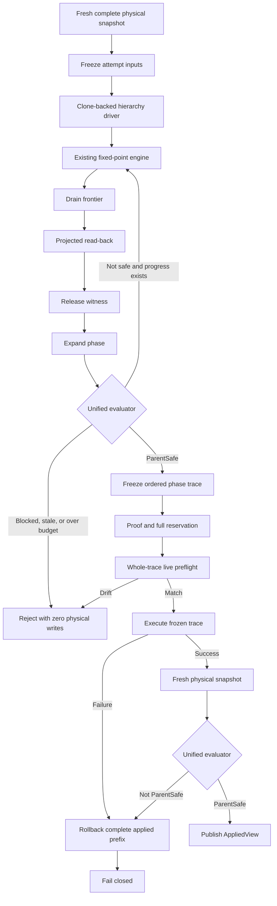

# Frozen Admission Fixed-Point Design

## Status

This design supersedes the single-plan admission closure introduced in
`5fcfb072e`. The implementation must delete that path rather than retain it as
a compatibility fallback.

## Problem

Hard-floor admission currently reserves a ticket before the first physical
write, but the ticket is derived from only the first drain plan plus a
synthetic canonical grow. The real coordinator continues through fresh
snapshots, drain frontiers, rebases, release witnesses, expand phases, and
additional fixed-point rounds.

The live failure on c546 demonstrated the mismatch:

1. The initial closure reserved and consumed 147 forward CPU writes.
2. The next real expand phase produced a grow for
   `kubepods/besteffort`.
3. The ticket had no remaining authorization for that relation.
4. Admission failed closed after physical progress had already occurred.

This is an ownership error. Proof and execution are not consuming the same
operation sequence.

## Required Outcome

Before the first physical write, admission must:

1. compile the complete Drain→Expand fixed-point sequence on a cloned
   hierarchy snapshot;
2. prove that the compiled final snapshot satisfies the same ParentSafe
   predicate used by live publication;
3. freeze the exact ordered operation sequence;
4. reserve all forward writes and the maximum inverse rollback writes;
5. execute only that frozen sequence against the live hierarchy;
6. rollback the complete applied prefix on any execution or final-proof
   failure;
7. publish only after a fresh physical read-back proves ParentSafe.

## Non-Negotiable Constraints

- No WAL, transaction identity, state fence, checkpoint file, checkpoint
  field, or schema change.
- No deletion or reset of `cpu_plugin_state`.
- No manual cgroup mutation.
- Real mandatory NUMA domains remain fully excluded from fake reclaim.
- `planWholeCoreCapacityQuotas` remains the sole quota owner.
- Required CPU sets come only from the frozen precommit contract.
- Reservation, proof, or preflight failure produces zero physical writes.
- AppliedView remains fail-closed and uses a fresh physical snapshot.
- The production Go 1.18.10 toolchain remains supported.

## First-Principles Decision

The irreducible invariant is:

> Admission success means that the physical hierarchy already satisfies the
> complete hard-floor ParentSafe contract.

The implementation must therefore have one operation owner. Extending
`proveAdmissionRequiredClosure` would preserve a second planner that predicts
what the coordinator may later do. The selected design instead executes the
same fixed-point engine twice:

1. against a clone-backed hierarchy driver to compile and freeze a trace;
2. against the live hierarchy to execute exactly that trace.

The two passes share planning, ordering, witness, deadlock, and convergence
logic. They differ only in the hierarchy backend and execution policy.

## Architecture



## Shared Fixed-Point Engine

The fixed-point loop must be extracted from the live-only
`coordinatorRound.executeFixedPointRound` orchestration. It accepts a hierarchy
session interface:

```go
type phaseExecutionSession interface {
    Snapshot(ctx context.Context) (*CompleteSnapshot, error)
    Apply(ctx context.Context, phase PhaseKind, operations []PlanOperation) error
}
```

The engine continues to own:

- `BuildPhasePlan`;
- `SplitPlanForAdmission`;
- drain frontier selection;
- drain rebase from the current session snapshot;
- transfer accumulation;
- `NewReleaseWitness`;
- `NewDomainGate`;
- expand planning;
- deadlock and no-progress checks;
- `evaluateCoordinatorSnapshot`;
- round and operation limits.

The engine does not know whether the session is simulated or live.

## Clone-Backed Hierarchy Model

The compiler cannot reuse the current `projectAdmissionOperation`, because it
sets configured and effective values to the same target and does not model
cgroup v2 inheritance.

The clone-backed model must implement the same observable state contract as
`HierarchyDriver`:

```go
type projectedHierarchy struct {
    snapshot     *CompleteSnapshot
    capabilities HierarchyCapabilities
    trace        []CompiledPhase
}
```

Its state transition rules are:

| Hierarchy | Write | Configured state | Effective state |
|---|---|---|---|
| cgroup v1 | non-empty CPU target | target | target |
| cgroup v1 | empty CPU target | reject before freeze | unchanged |
| cgroup v2 | non-empty CPU target | target | target after containment validation |
| cgroup v2 | empty CPU target | empty | inherit projected parent effective value |
| cgroup v2 | parent change with empty child | child stays empty | recursively recompute child effective value |

CPU and memory state are modeled independently. Every simulated write
recomputes:

- inherited effective CPU and memory sets;
- parent-child containment;
- domain unions;
- snapshot evidence ID;
- relevant child fingerprints.

The initial implementation may materialize a complete snapshot after each
operation for correctness. Copy-on-write optimization is allowed only after
the parity and benchmark gates pass.

## Frozen Trace

```go
type CompiledPhaseTrace struct {
    TraceID              string
    ConvergenceID        string
    Objective            ConvergenceObjective
    InitialSnapshot      *CompleteSnapshot
    CanonicalTargetByRel map[string]CPUSetTarget
    RequiredCPUSetByRel  map[string]machine.CPUSet
    Capabilities         HierarchyCapabilities
    Phases               []CompiledPhase
    FinalSnapshot        *CompleteSnapshot
    FinalEvaluation      coordinatorSnapshotEvaluation
    Cost                 ExecutionReservationCost
}

type CompiledPhase struct {
    Kind       PhaseKind
    Operations []PlanOperation
}
```

Freezing performs a deep copy of all maps, slices, CPU sets, snapshots,
entries, identities, and child lists. `TraceID` is deterministic and covers:

- initial snapshot evidence ID;
- objective and hierarchy capabilities;
- canonical targets and required sets;
- phase boundaries;
- every ordered operation and its expected current state;
- final snapshot evidence ID.

Mutation of the original planner inputs after freeze must not change the trace
or its ID.

## Proof

The compiler stops only when the existing production evaluator says the
objective is satisfied:

- `ConvergenceObjectiveFull` requires full convergence;
- `ConvergenceObjectiveParentSafe` requires `ParentSafety.Safe`;
- deferred cleanup remains visible in the final convergence report.

`admissionClosureSafetyReport` is deleted. There must be no simplified
admission-specific ParentSafe predicate.

The proof must include:

- required floor deficits;
- primary/reclaim overlap;
- pending CPUs outside primary;
- pending CPUs inside reclaim;
- unsafe required relations;
- deferred leaf overlap;
- hierarchy capability semantics;
- physical configured/effective observations.

## Reservation Ticket

The ticket authorizes an ordered trace, not a multiset of signatures:

```go
type ExecutionReservationTicket struct {
    traceID           string
    nextOperation     int
    reserved          ExecutionReservationCost
    consumedForward   PhysicalWriteCost
    consumedRollback  PhysicalWriteCost
    released          bool
}
```

Authorization binds:

- trace ID;
- phase index;
- operation index;
- relation and direction;
- expected current CPUs and mems;
- target CPUs and mems;
- cgroup identity and parent identity;
- child fingerprint;
- ownership flags.

The required reservation is:

```text
all CPU forward writes
+ all memory forward writes
+ one inverse rollback slot for every possible forward write
```

Physical CPU and memory writes are counted separately. The limit boundary is
exact: `required - 1` fails before any live write and `required` succeeds.

## Whole-Trace Preflight

Before the first live mutation, preflight compares the current hierarchy with
the frozen initial snapshot and then validates the complete operation sequence
against an in-memory overlay.

This validates later operations against the expected result of earlier
operations without touching the live hierarchy. It catches:

- initial state drift;
- identity changes;
- parent identity changes;
- child-set changes;
- operation reordering;
- invalid parent containment;
- v1 empty targets;
- impossible v2 inheritance;
- tampered expected-current or target values.

Any failure discards the trace and reservation with zero physical writes.

## Execution and Rollback

Execution consumes operations strictly in frozen order. The executor may
fresh-read for stale detection and post-write verification, but it cannot
replan, rebase, append, or reorder operations.

Each successful physical CPU or memory write pushes an inverse record onto an
in-memory mutation stack:

```go
type AppliedPhysicalWrite struct {
    Rel      string
    Identity CgroupIdentity
    Resource HierarchyOperation
    Before   string
    After    string
}
```

On any failure:

1. determine whether the failing write changed physical state;
2. push its inverse record if necessary;
3. rollback every record in strict reverse order;
4. continue attempting earlier rollback records after an individual rollback
   failure;
5. fresh-read the affected hierarchy;
6. report the execution error and all rollback errors.

Rollback success restores the invocation's initial physical state and removes
net progress from `ConvergenceResult.Journal` and `Applied`. Diagnostic
attempt/failure counters may remain.

Rollback incomplete is terminal for the current invocation. It never triggers
runtime replan or publication.

## Stale Semantics

| Time of drift | Required behavior |
|---|---|
| Before first write | discard trace, release ticket, read fresh snapshot, compile again |
| After first write | rollback complete prefix before returning |
| During rollback | continue all possible rollback operations, aggregate errors, fail closed |
| Before publish | final proof failure rolls back the complete trace |

No frozen trace survives across an admission attempt or process restart.

## Budgets

Three counters remain distinct:

1. compile budget: rounds, plan operations, deadlock probes, and model work;
2. hierarchy I/O budget: real snapshots, prechecks, writes, and read-backs;
3. physical admission budget: frozen forward and rollback writes.

The compiler must not run while holding `BudgetTracker.mu`. Compilation
returns an immutable cost; reservation then atomically checks and records that
cost.

## Ownership and Retirement

Anti-Entropy Declaration:

- Deletion class: internal code retirement.
- Old owner: `admissionRequiredOperationClosure` and synthetic grow proof.
- New canonical owner: `CompiledPhaseTrace` produced by the shared fixed-point
  engine.
- Preserved behavior: fail-closed proof, physical write accounting,
  read-back, rollback, and AppliedView validation.
- Retired behavior: single-plan closure prediction, signature multiset
  authorization, and runtime ticket expansion.
- External boundary: none.
- Persistent-state risk: none.
- Decision: delete-first.

The following symbols must be removed:

```text
admissionRequiredOperationClosure
proveAdmissionRequiredClosure
cloneAdmissionSnapshot
projectAdmissionOperation
recomputeAdmissionDomainUnion
admissionClosureSafetyReport
admissionClosureOperationCounts
reserveAdmissionClosure
```

No compatibility wrapper or feature flag is allowed.

## Verification

The design is accepted only when all of the following are demonstrated:

- offline and fake-live traces are identical for staged drain and dynamic
  descendant scenarios;
- cgroup v1 and v2 projection parity tests pass;
- ParentSafe uses one evaluator;
- reservation shortfall produces zero physical writes;
- trace tampering, skipping, repetition, and reordering fail closed;
- failures at every forward write position rollback the entire prefix;
- rollback failure does not stop attempts to restore earlier writes;
- final proof failure rolls back the entire trace;
- topology package and race tests pass;
- compile complexity is bounded and non-quadratic;
- Linux/amd64 Go 1.18.10 CGO build passes;
- c546 hard-floor admission completes without ticket expansion;
- restart and existing checkpoint compatibility remain unchanged.

## Falsification Conditions

The design must be revisited if any of these occur:

- the clone-backed model cannot reproduce a hierarchy state required by the
  live planner;
- offline and fake-live operation order differs for the same frozen input;
- a required planner decision depends on information absent from
  `CompleteSnapshot`;
- cgroup v2 effective state cannot be derived from configured state,
  capabilities, and parent state;
- whole-prefix rollback cannot be represented without persistent state;
- compile complexity exceeds the existing bounded planning model.
