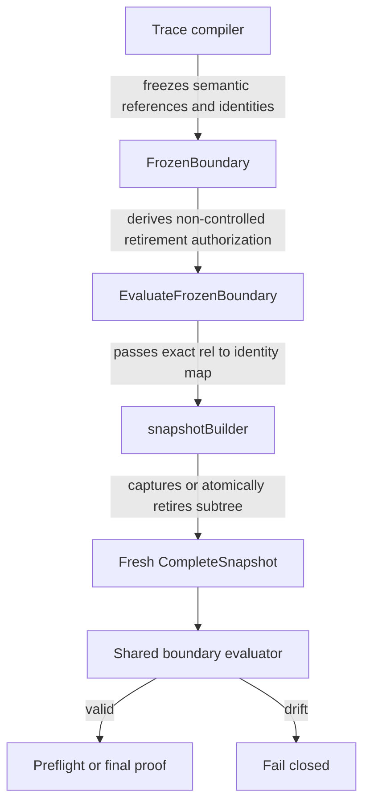
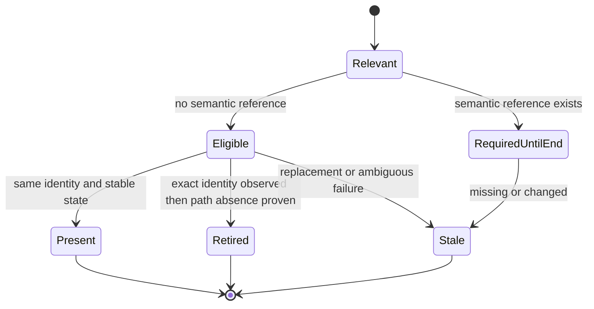

# Frozen Holder Retirement Atomicity Design

## Status

Proposed. This design follows the canonical E2E failure on
`98ad55e82a0f9076b5f6ab8d66bb179f173b0713`.

## Problem

The versioned frozen boundary allows an identity-pinned dynamic CPU holder to
retire when the compiled trace has no semantic dependency on that holder.
Commit `4fc0295cd` implemented that rule for three early scan windows:

- the initial `StatIdentity`;
- `ReadEntry`;
- the identity check after `ReadEntry`.

`snapshotBuilder.scan` publishes the entry and domain contribution before
`ListChildren`, then treats every list or later identity error as fatal. A
holder deleted after the second stat can therefore fail final proof even though
its retirement was authorized.

The third canonical run reproduced this exact sequence:

```text
round 2 chain A reaches RUNNING_12
chain A is deleted
chain B starts
shared-chain-b-1 final proof scans a deleted chain A pre-occupation holder
ListChildren(holder) returns ENOENT
admission fails closed and the physical write prefix is rolled back
```

The missing holder UID was still present in
`machineState.0.pre_occ_pod_entries`, was tagged with the current run, and had
no live Pod. No owned-pool capacity failure or cpuset overlap occurred.

## Root Cause

The scanner does not treat one node scan as a commit-or-retire transaction.
Its current order is:

```text
Stat(before)
ReadEntry
Stat(after-read)
publish Entry, DomainByRel, and DomainUnion
ListChildren
Stat(after-list)
scan children
return
```

This creates three defects:

1. Authorized retirement is not handled during `ListChildren`.
2. Authorized retirement is not handled by the identity fence after listing.
3. A parent can disappear while descendants are scanned because there is no
   recursion-completion identity fence.

A direct `ENOENT => success` branch after `ListChildren` would be incorrect.
At that point the snapshot may already contain the parent and descendants.
Furthermore, `ListChildren` can fail because a child disappeared while the
parent remains valid; that condition cannot authorize retirement of the parent.

## First Principles

### Required outcome

A frozen proof accepts disappearance only when the exact compile-time identity
was authorized to retire and the requested cgroup path is now absent. The
resulting snapshot must contain either the complete stable node subtree or no
evidence from that retired subtree.

### Non-negotiable constraints

- Controlled relations and roots never retire.
- Semantic holders never retire.
- Retirement permits disappearance only, not mutation or replacement.
- Identity replacement remains stale and fail-closed.
- Controller-interface absence, permission failure, I/O failure, deadline, and
  budget exhaustion never count as retirement.
- Preflight performs zero physical writes.
- Final-proof failure still rolls back the complete physical write prefix.
- Normal snapshots remain strict; retirement authorization is injected only by
  `EvaluateFrozenBoundary`.

### Smallest sufficient path

Keep frozen-boundary ownership unchanged. Make `snapshotBuilder.scan` own
transactional subtree retirement, tighten absence classification, and make the
filesystem driver tolerate a child that disappears during directory
enumeration. Do not add retries, Pod lookups, timeout changes, or caller-side
fallbacks.

## Ownership



The compiler remains the owner of semantic relevance. The snapshot builder
owns evidence acquisition and retirement atomicity. The filesystem driver owns
the distinction between stable parent enumeration and transient child removal.
No upper layer may convert a snapshot error into success.

## Retirement State Model



`Eligible` is not an error suppression state. Only a typed path-absence proof
can transition it to `Retired`.

## Detailed Design

### Strict absence classification

Add a retirement-specific predicate in `snapshot.go`:

```go
func isCgroupPathAbsent(err error) bool {
    if err == nil || errors.Is(err, ErrCgroupControllerUnavailable) {
        return false
    }
    return errors.Is(err, os.ErrNotExist) ||
        errors.Is(err, syscall.ENOTDIR) ||
        errors.Is(err, syscall.ENODEV)
}
```

Do not use the text fallback in `isCgroupNotFoundError` for retirement. The
cgroup v2 driver wraps a missing `cpuset.*` interface as
`ErrCgroupControllerUnavailable` while retaining “no such file” in the error
text. Treating that as cgroup retirement would erase valid evidence.

### Authorization

`frozenBoundaryRetirementAuthorizations` must exclude every
`FrozenBoundary.ControlledRels` entry. Shared paths used by a non-retirable
holder remain excluded through `indexFrozenRetirablePaths`.

Authorization remains:

```text
normalized relative path -> compile-time CgroupIdentity
```

The scanner accepts retirement only when the authorization identity equals the
identity obtained from the parent listing or the node's first successful stat.

### Child enumeration

`cgroupFSDriver.listChildrenWithBudget` should skip a child directory entry only
when `openChildDirWithIdentity` reports a typed path-absence error for that
child. The parent directory remains pinned by file descriptor and its identity
is checked after enumeration.

Other failures remain fatal:

- identity mismatch;
- symlink;
- cross-device traversal;
- permission failure;
- I/O failure;
- context cancellation;
- budget exhaustion.

After this change, a path-absence error returned for the requested parent from
`ListChildren` no longer ambiguously represents ordinary child churn.

### Transactional subtree retirement

Change `snapshotBuilder.scan` to return `(retired bool, err error)` and replace
the global `retired` side channel. All snapshot mutation remains centralized in
the builder.

Add:

```go
func (b *snapshotBuilder) authorizedRetirement(
    rel string,
    identity CgroupIdentity,
    err error,
) bool

func (b *snapshotBuilder) retireSubtree(
    rel string,
    identity CgroupIdentity,
)

func rebuildSnapshotDomainUnion(snapshot *CompleteSnapshot)
```

`retireSubtree` removes the path and all descendants from:

- `Entries`;
- `Children`;
- `UnavailableChildren`;
- `DomainByRel`;
- `ScanBoundary.ExpandedRels`.

It also removes the matching `ChildRef` from the direct parent. The child edge
is removed only when both path and identity match the authorization.

`DomainUnion` is no longer incrementally authoritative. Rebuild it once from
the final committed `Entries` and `DomainByRel` before computing `SnapshotID`.
This avoids incorrect set subtraction when multiple entries hold overlapping
CPUs.

### List failure attribution

When `ListChildren(rel)` returns a typed path-absence error for an authorized
identity:

1. Call `StatIdentity(rel)` once.
2. If it returns typed path absence, retire the subtree.
3. If it returns the same identity, preserve the original list failure.
4. If it returns another identity, return `ErrCgroupIdentityChanged`.
5. If it returns any other error, fail with that typed stat error.

No retry is performed.

### Recursion-completion fence

Move the current path-based stat after `ListChildren` to the end of child
recursion:

```text
Stat(before)
ReadEntry
Stat(after-read)
publish provisional node evidence
ListChildren
scan children
Stat(after-recursion)
commit success or retire subtree
```

`ListChildren` already pins and validates the parent directory identity for the
duration of enumeration. Moving the external fence preserves the existing
five logical hierarchy calls for every stable expanded node while covering
both post-list and recursive-disappearance windows.

### Final structural validation

Before fingerprinting a successful snapshot, validate:

- each entry has exactly one domain;
- each domain relation has an entry;
- each `Children` parent has an entry;
- each `ChildRef` resolves to either an entry with the same identity or matching
  unavailable-child evidence;
- every expanded relation has an entry;
- every root has an entry;
- no duplicate child name exists under one parent;
- `DomainUnion` equals the union rebuilt from committed entries.

This validation is defense in depth. It must not repair malformed evidence.

## Failure Semantics

| Condition | Result |
| --- | --- |
| Authorized identity, requested path confirmed absent | Retire subtree and continue |
| Authorized identity, parent still exists after list failure | Return original list failure |
| Same path has a different identity | Return identity-changed stale error |
| Non-retirable holder disappears | Return typed snapshot error |
| Controlled/root relation disappears | Return typed snapshot error |
| cpuset controller interface is missing | Preserve controller-unavailable behavior |
| Permission, I/O, deadline, or budget error | Fail closed |
| New relevant holder appears | Frozen boundary stale |

## Budget Impact

The stable scan path remains unchanged:

| Node | Before | After |
| --- | ---: | ---: |
| Non-expanded leaf | 3 logical I/O calls | 3 |
| Stable expanded node | 5 logical I/O calls | 5 |
| Authorized parent missing during list | 4 calls | 5, including confirmation stat |

The existing automatic `MaxSnapshotNodes * 5` bootstrap remains valid. The
extra confirmation stat replaces work that ends immediately on the retirement
path and does not increase the stable-node upper bound. Explicit budgets remain
hard limits.

## Test Strategy

### Unit RED matrix

Add exact operation hooks for:

1. initial stat disappearance;
2. read-entry disappearance;
3. post-read stat disappearance;
4. parent disappearance inside `ListChildren`;
5. disappearance at the recursion-completion stat;
6. parent disappearance while a descendant is scanned;
7. child disappearance during parent enumeration with stable parent;
8. same-path replacement after list;
9. controller-interface absence;
10. permission, I/O, deadline, and budget failures;
11. controlled and semantic-holder disappearance;
12. nested and sibling retirements.

Every successful retirement test must assert the absence of ghost entries,
children, domains, unavailable evidence, expanded relations, and CPU union.

### Integration tests

Add an `executeFrozenTrace` test where a non-semantic holder retires during
final proof after at least one physical operation. The trace must succeed,
publish a current final snapshot, and avoid rollback.

Add the negative twin where a required holder disappears. It must fail,
rollback the full prefix, and leave `FinalSnapshotCurrent=false`.

### Linux driver test

Use a temporary filesystem hierarchy with the real `cgroupFSDriver` FD engine.
Delete a child between `ReadDir` and `openChildDirWithIdentity`; `ListChildren`
must return the stable surviving set. Delete the requested parent before or
during enumeration; the returned error must remain a typed path-absence error.

### Repetition and race

Run retirement tests with `-count=100`, then the topology package under
`-race`. No test may use sleeps to select a race window.

## Validation Gates

1. Focused RED proves the current HEAD fails the true list and recursive
   retirement cases.
2. Focused GREEN passes the complete positive and negative matrix.
3. All topology and cpusettopology package tests pass.
4. Dynamic-policy tests pass.
5. Race tests pass.
6. Linux native driver tests pass.
7. A focused overlap E2E reproduces the round-2 A-to-B deletion pattern without
   admission failure.
8. Three independent canonical full E2E runs pass:
   reset, target, standard 3 rounds, high churn 5 rounds, overlap 3 rounds, and
   final reset.
9. Logs contain no final snapshot retirement ENOENT, capacity failure,
   overlap, budget exhaustion, panic, or rollback uncertainty.
10. Each evidence archive has matching local/remote SHA-256 and passes
    `tar -tzf`.

## Rejected Alternatives

### Ignore every `ListChildren` ENOENT

Rejected because the error may describe a disappearing child while the parent
still exists. Retiring the parent would widen the proof boundary.

### Retry final proof

Rejected because execution has already performed physical writes. A retry
would hide an unclassified state transition and complicate rollback authority.

### Query Pod state

Rejected because Pod/API truth is not atomic with cgroup identity and would add
a second owner for retirement.

### Increase timeout or add sleep

Rejected because the defect is an uncovered lifecycle window, not slow
convergence.

### Keep incremental state and only delete the entry

Rejected because it leaves dangling child edges, stale domains, stale expanded
relations, and an incorrect CPU union.

## Acceptance Criteria

The repair is complete when the scanner can prove exact authorized retirement
at every node scan boundary, cannot misclassify controller or child churn as
parent retirement, returns structurally closed snapshots, preserves the
five-call stable-node budget, and passes three canonical full E2E runs without
weakening any fail-closed gate.
