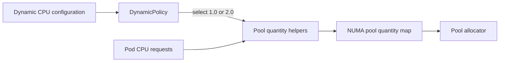

# Hard-Partition SNB Pool Ratio

## Goal

Use a `1.0` CPU increment ratio for shared-core NUMA-binding (SNB)
allocations when hard reclaim partitioning is active. Preserve the existing
`2.0` burst ratio in every other configuration.

Hard reclaim partitioning is active only when both
`EnableReclaim` and `EnableRampUpReclaimHardPartition` are true.

## Behavior

| EnableReclaim | EnableRampUpReclaimHardPartition | SNB ratio |
| --- | --- | --- |
| false | false | `2.0` |
| false | true | `2.0` |
| true | false | `2.0` |
| true | true | `1.0` |

Non-NUMA-binding shared pools, dedicated allocations, isolated allocations,
and reclaim accounting remain unchanged.

## Ownership

`DynamicPolicy` owns the configuration-dependent decision because it already
owns the effective hard-partition predicate. Generic state helpers remain
configuration-agnostic and receive the selected SNB ratio explicitly.



The implementation must not compensate for the old ratio by mutating or
dividing the request callback. Request quantities retain their original
meaning.

## Data Flow

`DynamicPolicy` selects the ratio through one policy-level helper:

```text
isRampUpReclaimHardPartitionEnabled() == true  -> 1.0
otherwise                                      -> 2.0
```

The selected ratio is passed through both quantity paths:

1. Advisor-healthy admission increments, where existing advised pool sizes
   are augmented by the incoming request.
2. Advisor-disabled or degraded reconstruction, where pool quantities are
   recalculated from all allocation entries.

`CountAllocationInfosToPoolsQuantityMap` applies the supplied ratio only when
`AllocationInfo.CheckSharedNUMABinding()` is true. All other shared entries
continue to use the default `1.0` ratio.

## Compatibility

The state helpers' signatures change to accept an explicit SNB ratio. There
are no external package consumers outside the CPU dynamic policy and its
tests. Existing behavior remains the default when hard reclaim partitioning
is inactive.

Existing advisor-provided pool CPU sets remain authoritative. This change
affects request-derived quantities and admission increments; it does not
silently rewrite an already advised pool size.

## Tests

RED-first tests must prove:

- Four `1 CPU` SNB entries produce quantity `4` with ratio `1.0`.
- The same entries produce quantity `8` with ratio `2.0`.
- Hard partition active selects `1.0`.
- Either hard-partition prerequisite being false selects `2.0`.
- Non-binding shared entries remain unchanged.
- Advisor-healthy admission increments and degraded full reconstruction use
  the same selected ratio.

Targeted state and dynamic-policy tests must pass before broader CPU plugin
tests are run.
