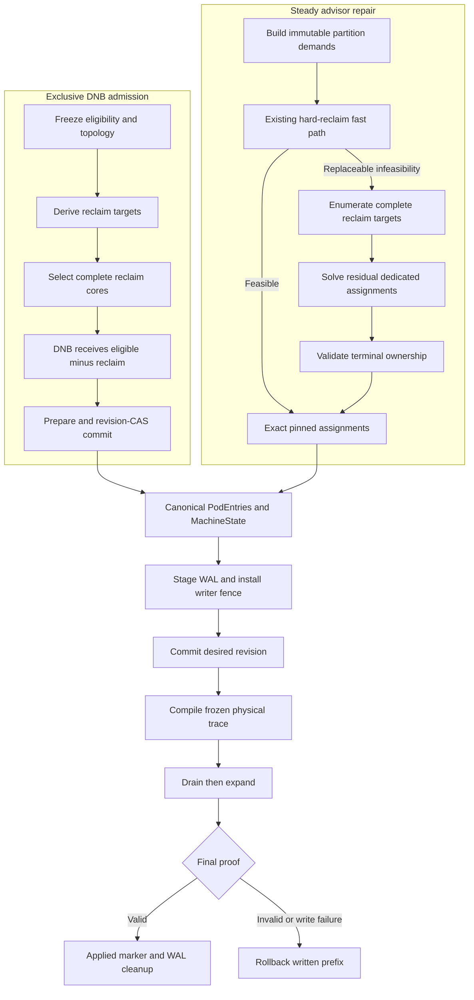

# Dedicated–Reclaim Atomic Replacement Design

## Problem

An exclusive NUMA-binding dedicated workload can leave the residual reclaim
partition with the requested logical CPU quantity but without enough complete
physical cores. The production state on `fdbd:dc06:1:80c::47` demonstrates the
failure:

```text
NUMA 2 reclaim/default:
  32,46,47,96,108,109,110,111

NUMA 2 dedicated:
  33-45,97-107
```

The reclaim set has eight logical CPUs but only three complete physical cores.
CPUs `108` and `109` are separated from their SMT siblings `44` and `45`, which
belong to dedicated. The steady hard-reclaim planner therefore reports:

```text
plan steady real-NUMA reclaim partition: NUMA 2 needs 2 more reclaim CPUs
```

The malformed ownership predates the current planner. The pod was created on
2026-09-17, and twelve seconds after the earliest retained QRM startup on
2026-09-18 the checkpoint already contained the same allocation. The current
planner correctly rejects the inherited layout but cannot repair it.

Two gaps must be closed:

1. Admission must not create a dedicated/reclaim boundary that splits physical
   cores. When the configured reclaim ratio cannot be represented exactly by
   complete cores, admission must round the soft reclaim target down and leave
   the remainder with the DNB allocation.
2. Steady repair must allow a same-NUMA, quantity-preserving ownership
   replacement between dedicated and reclaim. The current donor model counts
   CPUs removed from dedicated as gross donation and does not credit CPUs
   returned to dedicated.

## Required Behavior

### Admission

- Do not reject an exclusive DNB admission merely because the ratio-derived
  reclaim quantity is not representable by complete physical cores.
- Select the largest complete-core reclaim set not exceeding the soft
  ratio-derived target.
- Preserve configured identity-bearing reclaim CPUs. Such identities remain
  fail-closed because silently dropping them changes resource identity rather
  than capacity.
- Let the remainder stay in the same-NUMA DNB partition, even when this makes
  the DNB allocation larger than the advisor block result.
- Keep the final DNB and reclaim sets disjoint and require their union to equal
  the eligible exclusive partition.

### Steady repair

- Preserve each affected dedicated request group's per-NUMA logical CPU count
  during a lossless replacement.
- Preserve each real-NUMA reclaim target quantity.
- Require the final reclaim assignment, rather than each ownership delta, to be
  a union of complete physical cores.
- Permit a dedicated group already below its canonical request to exchange CPUs
  when its final ownership does not decrease.
- Use the existing one-way borrow path only for positive net dedicated loss.
- Reject cross-NUMA replacement, partial results, and unbounded search.

### Transaction

- Produce one final assignment for all affected demands.
- Commit dedicated and reclaim ownership under one revision.
- Reuse the existing advisor WAL, writer fence, frozen trace, physical apply,
  and rollback machinery.
- Do not add a separate swap WAL or a physical `Swap` primitive.

## Non-goals

- Do not move a NUMA-bound dedicated workload across NUMA nodes.
- Do not reduce identity-bearing reclaim requirements.
- Do not relax exact advisor block quantity outside the explicit admission
  over-allocation rule.
- Do not change SysAdvisor or CPU eviction reserved-reclaim rounding semantics.
- Do not introduce retry loops, sleeps, or post-hoc state mutation.
- Do not persist a solver-specific replacement proof.

## Terminology

`canonical request` is the authoritative request floor for a donor ownership
group. It is derived from `AllocationInfo.RequestQuantity`, grouped by
`requestGroupKey` so aliases and accompanying containers sharing one allocation
are not counted repeatedly, and rounded up with `ceil`.

For an existing under-provisioned group, repair must not make the situation
worse:

```text
protectedFloor = min(oldOwned, ceil(canonicalRequest))
```

For a pure replacement:

```text
newOwnedByNUMA == oldOwnedByNUMA
netDonation == 0
```

## Architecture



## Admission Design

### Scope

The new rounding behavior applies only when all of the following hold:

- the workload uses exclusive NUMA binding;
- hard reclaim partitioning is enabled;
- dedicated/reclaim overlap is disabled;
- admission is deriving the steady reclaim floor for a non-reclaimable DNB.

The ramp-up reclaim path already computes ratio capacity in physical-core units
and does not need this change.

### Target derivation

Do not change `machine.ResolvePerNUMAReservedForReclaim` globally. Its round-up
contract is shared by SysAdvisor and CPU eviction.

Add an admission-scoped helper in `policy_allocation_handlers.go`:

```go
func deriveAdmissionSteadyReclaimTarget(
    topology *machine.CPUTopology,
    eligible machine.CPUSet,
    preferred machine.CPUSet,
    mandatory machine.CPUSet,
    ratio float64,
    configuredMinimum int,
) (machine.CPUSet, error)
```

The helper operates on actual physical-core sibling sets, not only a
machine-wide `CPUsPerCore` value:

1. Complete and validate `mandatory` within `eligible`.
2. Compute the logical-CPU ratio budget using floor semantics.
3. Select the largest complete-core set whose size does not exceed that budget.
4. Add complete cores until a feasible configured minimum is met.
5. If a non-identity soft minimum is infeasible, clamp it to the largest
   feasible complete-core set instead of rejecting admission.
6. Return a deterministic set ordered by preferred-hit count and physical core
   key.

`deriveSteadyReclaimFloor` uses this helper instead of applying the global
round-up resolver directly.

### Remainder ownership

The existing admission flow starts from the complete exclusive partition and
later removes the selected `hardReclaimCPUs` from the provisional DNB
allocation. Preserve that flow:

```text
finalReclaim = selected complete cores
finalDNB     = partitionEligible - finalReclaim
```

No explicit `DNB = DNB union remainder` mutation is added. The complement
operation already keeps the remainder in the correct NUMA and eligibility
domain.

Admission may therefore produce:

```text
advisor DNB result: 24
actual DNB result:  26
reclaim target:      6
```

The existing hard-partition idempotency rule continues to use
`OriginalAllocationResult` and `RequestQuantity` so this intentional
over-allocation does not trigger repeated admission.

### Admission validation

Before revision CAS, verify:

```text
DNB intersection reclaim is empty
DNB union reclaim equals partitionEligible
reclaim is core-aligned
mandatory identities are preserved
all assignments remain within hinted NUMAs
```

Record structured diagnostics for any soft-target degradation:

```text
requestedReclaimQuantity
actualReclaimQuantity
actualDNBQuantity
reason = whole_core_capacity
```

Use `katalyst-core/pkg/util/general` for logging. Any metric must use the closed
label taxonomy already established for allocation failures.

## Steady Replacement Design

### Why the existing donor model fails

The current hard-reclaim planner computes:

```text
groupDonationLimit = oldOwned - ceil(canonicalRequest)
grossDonation      = oldDedicated intersect newReclaim
```

It rejects a candidate when `grossDonation` exceeds the limit. This is correct
for one-way borrow but incorrect for replacement because it ignores CPUs
returned to dedicated.

For the production state, the valid replacement is:

```text
reclaim:
  - {108,109}
  + {33,97}

dedicated:
  - {33,97}
  + {108,109}
```

The incoming dedicated delta `{108,109}` is not itself a complete physical
core. Combined with retained dedicated CPUs `{44,45}`, however, the final
dedicated ownership is valid. Validation must therefore reason about final
assignments, not require each delta to be core-aligned.

### Fast path and fallback

Keep `planHardReclaimPartition` unchanged as the preferred fast path. Add a
replacement-aware fallback only for typed, potentially repairable selection
failures.

```go
type hardReclaimSelectionFailureReason string

const (
    hardReclaimFailureInsufficientWholeCore hardReclaimSelectionFailureReason = "insufficient_whole_core"
    hardReclaimFailureDonorFloor            hardReclaimSelectionFailureReason = "donor_floor"
    hardReclaimFailureSearchBudget          hardReclaimSelectionFailureReason = "search_budget"
)

type hardReclaimSelectionError struct {
    Reason  hardReclaimSelectionFailureReason
    NUMAID  int
    Deficit int
    Cause   error
}
```

Topology corruption, unknown NUMA IDs, invalid eligibility, duplicate owner
identity, and unsupported donor classes remain immediate failures.

### Replacement-aware solver

Add:

```go
type hardReclaimReplacementOptions struct {
    MaxCandidateStates int
    MaxTerminalSolves  int
}

type hardReclaimReplacementProof struct {
    ReclaimBefore machine.CPUSet
    ReclaimAfter  machine.CPUSet

    DedicatedBeforeByGroup map[string]machine.CPUSet
    DedicatedAfterByGroup  map[string]machine.CPUSet
}

func solveHardReclaimWithReplacement(
    demands []partitionDemand,
    available machine.CPUSet,
    topology *machine.CPUTopology,
    options hardReclaimReplacementOptions,
) (map[string]machine.CPUSet, *hardReclaimReplacementProof, error)
```

The proof is transient. It exists for validation, deterministic diagnostics, and
tests only.

### Phase 1: reclaim candidate search

Build complete-core candidates from:

```text
currentReclaim union free union dedicatedOwned
```

intersected with reclaim eligibility. Enumerate candidates with the existing
bounded frontier rules:

- exact target quantity per NUMA;
- complete physical cores only;
- maximize retained reclaim CPUs;
- minimize changed CPUs;
- minimize touched dedicated groups;
- deterministic physical-core ordering.

Do not apply the gross donation limit while enumerating replacement candidates.
The terminal residual solve proves whether dedicated can receive legal
replacement CPUs.

### Phase 2: residual assignment

For each terminal reclaim candidate:

1. Assign the selected CPUs exactly to mandatory reclaim demands.
2. Remove the selected reclaim CPUs from every non-reclaim demand's eligibility.
3. Invoke the existing disjoint partition solver for dedicated and bound-share
   demands.
4. Reject the candidate unless every demand receives its exact quantity.
5. Validate final ownership against the frozen before-state.

The solver returns complete final assignments:

```go
map[demandKey]machine.CPUSet
```

It does not return an imperative swap sequence.

### Terminal validation

Add:

```go
func validateHardReclaimReplacement(
    demands []partitionDemand,
    assignments map[string]machine.CPUSet,
    topology *machine.CPUTopology,
    targetByNUMA map[int]int,
) (*hardReclaimReplacementProof, error)
```

The validator proves:

- every assignment size equals its demand quantity;
- assignments are pairwise disjoint;
- each assignment is a subset of its eligibility;
- final reclaim is core-aligned;
- each NUMA receives its exact reclaim target;
- each dedicated request group preserves its per-NUMA count for pure
  replacement;
- no group falls below `min(oldOwned, ceil(canonicalRequest))`;
- no replacement crosses NUMA boundaries;
- all CPUs belong to the frozen topology.

The validator does not require `DedicatedBefore - DedicatedAfter` or
`DedicatedAfter - DedicatedBefore` to be independently core-aligned.

### Exact pinning

Add:

```go
func pinPartitionDemandsToAssignments(
    demands []partitionDemand,
    assignments map[string]machine.CPUSet,
) ([]partitionDemand, error)
```

For each demand:

```go
demand.eligible = assignment.Clone()
demand.preferred = assignment.Clone()
```

The downstream generic solver then acts as a deterministic consistency check
and cannot choose a different, unproved assignment.

### Integration point

Extend `pinHardReclaimPartitionDemands`:

```text
existing hard-reclaim plan succeeds
  -> preserve current behavior

existing plan returns a replaceable typed failure
  -> run replacement-aware terminal solve
  -> validate final assignments
  -> pin every affected demand exactly

replacement solve fails
  -> return a closed, typed infeasibility
```

Enable the fallback for the steady real-NUMA hard-partition path and the
hard-active advisor path. Admission does not use this fallback; it uses the
complement-based over-allocation design described earlier.

## State and Persistence

No persistent schema changes are required.

`pendingAdvisorState`, `pendingCPUPartition`, and the existing advisor
post-commit WAL already carry complete final `PodEntries`, `MachineState`, and
revision identity. Recovery needs the final target, not the solver proof or an
imperative exchange log.

The transaction remains:

```text
prepare immutable candidate
-> validate
-> install writer fence
-> persist staging WAL
-> revision-CAS canonical state
-> promote active WAL
-> physical reconciliation
-> persist applied marker
-> remove WAL and release fence
```

## Physical Apply and Rollback

Do not add a physical swap operation. The Bulkhead topology compiler receives
the final partition and produces the safe mutation sequence.

The expected shape is:

```text
Drain:
  remove outgoing CPUs from reclaim
  remove outgoing CPUs from dedicated

Expand:
  add incoming CPUs to reclaim
  add incoming CPUs to dedicated
```

The existing frozen-trace execution remains authoritative:

- complete preflight before the first write;
- immutable target and rollback ticket;
- ParentSafe ordering;
- reverse rollback of the entire written prefix;
- final frozen-boundary proof;
- no logical progress publication after a successful rollback;
- retained WAL and writer fence when the canonical desired state still needs
  physical convergence.

Canonical state is not revision-rolled back after a physical failure. The
physical prefix is compensated, and the same desired revision is retried.

## Failure Semantics

| Failure | Canonical state | Physical state | Result |
|---|---|---|---|
| Admission soft target is not exactly representable | Commit reduced whole-core reclaim and over-allocated DNB | Apply final partition | Success with degradation diagnostic |
| Mandatory reclaim identity is infeasible | Unchanged | No writes | Fail closed |
| Replacement candidate is infeasible | Unchanged | No writes | Typed planning error |
| Search budget is exhausted | Unchanged | No writes | Typed budget error |
| Precommit validation fails | Unchanged | No writes | Fail closed |
| Revision CAS fails | Unchanged | No writes | Stale-state retry by caller |
| WAL staging fails | Unchanged | No writes | Fence remains when cleanup is uncertain |
| Physical preflight fails | New desired revision remains authoritative | No writes | Retry same target |
| Physical write fails and rollback succeeds | New desired revision remains authoritative | Restored to pre-attempt state | Retry same target |
| Physical rollback fails | New desired revision remains authoritative | Net impact recorded | Block new frames |
| Applied marker or cleanup fails | New desired revision remains authoritative | Already converged | Retry marker or cleanup only |

## Test Strategy

### Admission

Add tests in `policy_allocation_handlers_test.go`:

1. Ratio-derived odd logical quantity rounds down to available complete cores.
2. The remainder remains in the same-NUMA DNB assignment.
3. DNB may exceed the advisor block result.
4. DNB and reclaim are disjoint and cover the complete eligible partition.
5. A configured mandatory identity is never silently removed.
6. Multi-NUMA remainder stays local to each NUMA.
7. Non-uniform SMT uses actual sibling sets.
8. Commit failure leaves revision, entries, and machine state unchanged.

### Replacement solver

Add tests in `hard_reclaim_partition_test.go`:

1. Reproduce the NUMA 2 production shape and the current `needs 2 more` failure.
2. Repair it with equal-size replacement while the donor is already below its
   canonical request.
3. Reject a final dedicated count below the protected floor.
4. Reject replacement available only from another NUMA.
5. Reject a final reclaim set containing a partial core.
6. Keep multiple request groups isolated.
7. Handle multiple aliases sharing one request group without double counting.
8. Preserve the existing fast-path result when no replacement is required.
9. Produce the same result after demand and map order permutations.
10. Return a typed error when the candidate or terminal-solve budget is
    exhausted.

### Advisor integration

Add tests in `policy_advisor_source_pool_test.go`:

- verify exact pinned assignments after replacement;
- verify the original no-replacement infeasible case still fails;
- verify final block quantities and NUMA scope;
- verify no unproved re-solve changes the selected target.

### Precommit and recovery

Add tests in:

- `partition_precommit_test.go`;
- `policy_advisor_handler_test.go`;
- `bulkhead/utils/topology/phase_trace_execution_test.go`.

Cover:

- hook mutation of quantity or NUMA scope is rejected;
- staging WAL precedes revision CAS;
- CAS advances exactly once;
- physical failure rolls back the complete written prefix;
- retry uses the same revision and exact target;
- final proof drift triggers rollback;
- applied marker and WAL cleanup preserve existing recovery behavior.

## Verification

Run focused RED/GREEN tests first, then package and race verification:

```bash
go test ./pkg/agent/qrm-plugins/cpu/dynamicpolicy \
  -run 'Admission.*Reclaim|HardReclaim.*Replacement|Advisor.*Replacement' \
  -count=1

go test ./pkg/agent/qrm-plugins/cpu/dynamicpolicy \
  -run 'Admission.*Reclaim|HardReclaim.*Replacement|Advisor.*Replacement' \
  -count=20

go test ./pkg/agent/qrm-plugins/cpu/dynamicpolicy -count=1

go test -race ./pkg/agent/qrm-plugins/cpu/dynamicpolicy \
  -run 'HardReclaim.*Replacement|Advisor.*Replacement' \
  -count=1

go test ./pkg/agent/qrm-plugins/cpu/dynamicpolicy/bulkhead/utils/topology \
  -run 'Trace|Rollback|Swap' \
  -count=1

git diff --check
git status --short
```

Host verification must demonstrate:

- no repeated `NUMA 2 needs 2 more reclaim CPUs`;
- reclaim is a union of complete physical cores on NUMA 2 and NUMA 3;
- dedicated and reclaim retain the intended per-NUMA quantities during steady
  replacement;
- a new exclusive DNB admission uses whole-core reclaim down-rounding and keeps
  the remainder in DNB;
- no partial state survives an injected physical write failure;
- the advisor WAL, applied marker, and writer fence converge and clean up.

## Delivery Boundaries

Implement as four logical commits:

1. RED tests for admission degradation and steady replacement.
2. Admission whole-core down-rounding and DNB remainder ownership.
3. Replacement-aware hard-reclaim solver and exact assignment pinning.
4. Precommit, WAL, physical rollback, repeated, and race verification.

Do not include unrelated refactoring, generated artifacts, environment changes,
or `go.mod` modifications.
