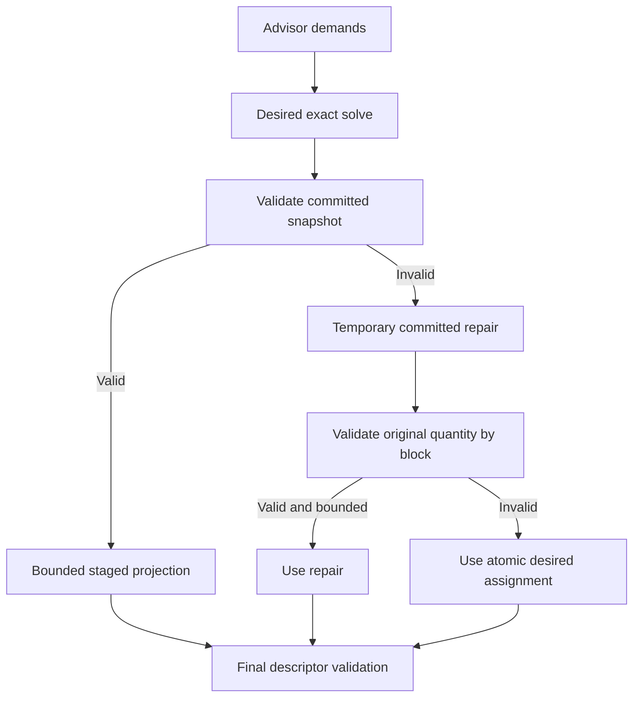

# Steady Reclaim Repair Contract Design

## Problem

When a restored QRM state has non-empty fake-NUMA reclaim CPUs but a newly required
real-NUMA reclaim floor has no committed CPUs, invalid-snapshot repair rewrites every
reclaim demand to its intersection with the committed reclaim union. This changes the
real-NUMA demand quantity from a positive whole-core requirement to zero.

The core-floor solver accepts the resulting empty assignment because an empty CPU set is
technically core-aligned. Repair therefore returns an assignment that satisfies the
rewritten demands but violates the original advisor block quantities. Final descriptor
validation rejects the plan and the same advice fails on every cycle.

## Required Behavior

Repair may change internal per-NUMA placement but must never change an externally
negotiated advisor block quantity. Before returning a repair assignment, the planner
must aggregate expanded demands by their block identity and compare the assigned and
requested quantities. If any block differs, the existing atomic desired assignment is
used instead.

A core-floor constraint requires a positive quantity and a non-empty assignment. Empty
assignments must fail closed even if the generic alignment helper considers them aligned.

## Design

### Original-demand validation

`projectSteadyFakeNUMAStageWithBudgetAndPins` may continue using temporary
`repairDemands` to reconstruct the committed reclaim placement. A repair candidate is
accepted only when:

1. it satisfies the temporary repair solve;
2. every advisor block keeps its original aggregate quantity;
3. it respects the migration churn limit.

If any condition fails, the function returns the already validated `desired` assignment.
This preserves the existing low-churn repair path for candidates that do not weaken the
original block contract. Internal per-NUMA expansion keys are intentionally not compared
one by one because bounded migration may temporarily differ from the final balanced
quota while preserving the block's aggregate quantity.

### Core-floor validation

`solveDisjointPartitionsWithPinnedCoreFloors` rejects a floor demand whose quantity is
non-positive or whose assignment is empty. The check belongs to the floor solver because
that component owns the complete-core invariant.

### Compatibility

The change does not modify advisor wire data, block identities, checkpoint schema,
mutation ordering, or migration limits. It adds no retry, sleep, or new metric owner.

## Data Flow

## Tests

1. Reproduce a non-empty committed fake reclaim union with an empty real-NUMA reclaim
   floor and assert that projection preserves all original quantities.
2. Assert that a zero-quantity core-floor demand is rejected.
3. Assert that an empty core-floor assignment is rejected.
4. Keep existing valid bounded-repair tests passing.

## Verification

Run focused tests for steady fake-NUMA repair and core floors, the full dynamicpolicy
package, repeated focused tests, and race tests. Host validation must show exact
`dedicated=30`, `real reclaim=2`, and `fake reclaim=28` allocation without repeated
`planned quantity 0 does not match 2` failures.
