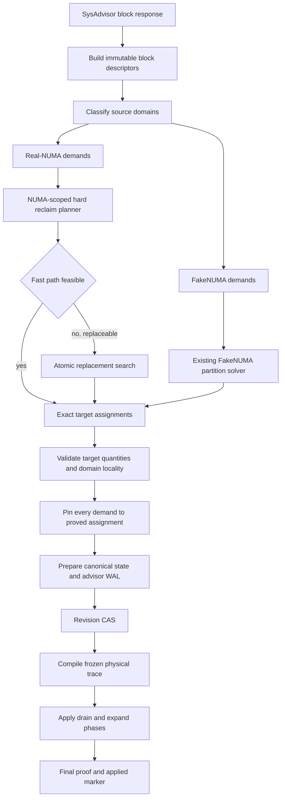
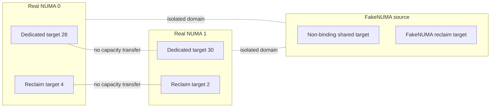

# NUMA-Scoped Target-Driven Dedicated–Reclaim Partition Design

## Status

This document defines the target semantics for CPU advice in which a
NUMA-binding dedicated or shared source pool may lend CPUs to reclaim. The
advisor block quantity is authoritative for the current calculation round, even
when it is smaller than the workload's declared CPU request or its previously
committed CPUSet.

**What the shipped implementation actually does.** The implementation that
landed uses *three existing runtime dynamic-configuration gates* together:

```
EnableReclaim && EnableRampUpReclaimHardPartition && DisableDedicatedCoresOverlapReclaimedCores
```

It does **not** modify `cpu.proto`, does **not** add a new negotiated wire
field, and does **not** introduce a new Katalyst FeatureGate. When all three
gates are on, QRM treats the advisor block `quantity` for a NUMA-scoped
dedicated/shared donor as a *retained floor* (the "target"): the dedicated
pool may shrink down to that target and lend the difference to the local
reclaim pool. This is a planner-side hard-reclaim donation rule, not a Pod
colocation mode and not a `numa_exclusive` attribute.

This design supersedes two constraints from
`2026-09-21-dedicated-reclaim-atomic-replacement-design.md`:

* a dedicated request group is no longer required to preserve its old
  per-NUMA ownership count when the current advisor result requests a
  different count;
* `RequestQuantity` is no longer a hard donation floor for target-driven
  dedicated or shared blocks.

The earlier document remains authoritative for atomic replacement, bounded
search, whole-core reclaim, exact pinning, WAL ownership, physical apply, and
rollback.

> **Historical note on terminology.** Earlier revisions of this document called
> the lending source pool "mixable" / "numa_mixable" and described a
> `negotiated-v1` wire protocol extension. That protocol extension was
> **not implemented**; see
> [Historical design: negotiated protocol extension (deprecated, not implemented)](#historical-design-negotiated-protocol-extension-deprecated-not-implemented).
> The shipped feature is referred to throughout this document as
> *target-driven hard reclaim*.

## Production Evidence

The failure was reproduced on a four-NUMA production-shaped node.

The machine has four real NUMA nodes, each with 32 logical CPUs and SMT2.
The applied QRM checkpoint was:

```
NUMA 0:
  dedicated = 1-15,65-79      size=30
  reclaim   = 0,64            size=2

NUMA 1:
  dedicated = 17-31,81-95     size=30
  reclaim   = 16,80           size=2

NUMA 2:
  dedicated = 36-47,100-111   size=24
  reclaim   = 32-35,96-99     size=8

NUMA 3:
  dedicated = 52-63,116-127   size=24
  reclaim   = 48-51,112-115   size=8
```

The dedicated request group on NUMA 0 and NUMA 1 declared 62 CPUs but was
already bound to 60 CPUs. SysAdvisor alternated between these real-NUMA
targets:

```
scenario: shrinks NUMA 0:
  NUMA 0 dedicated target = 28
  NUMA 1 dedicated target = 30

scenario: shrinks NUMA 1:
  NUMA 0 dedicated target = 30
  NUMA 1 dedicated target = 28
```

The corresponding reclaim block remained local to the source NUMA. QRM
rejected every round:

```
hard reclaim fast path failed: NUMA 0 needs 2 more reclaim CPUs;
replacement failed: no feasible hard reclaim replacement:
no global hard reclaim replacement is feasible
```

or the same error for NUMA 1.

The replacement search completed rather than exhausting a budget:

```
complete=true
generatedCandidateStates=10498
deduplicatedCandidateStates=140
terminalStates=100
maxAssignmentEdgesInGraph=128
flowOperations≈343000
```

The checkpoint, advisor targets, and diagnostics above are design input and a
locally reproduced equivalent fixture. The raw same-revision advisor response,
checkpoint, and diagnostics for the production node are not archived in this
revision, so this is not a claim that the production node has been reproduced
on real hardware. The `flowOperations≈343000` value is an observed
old-implementation search cost; it is not by itself proof that the cost is
unacceptable. Acceptability must be measured against the scheduler latency SLO
after the target-aware implementation exists.

The rejection was caused by two local invariants:

```
donationLimit = oldDedicatedSize - ceil(RequestQuantity)
dedicatedAfterByGroupNUMA == dedicatedBeforeByGroupNUMA
```

Both invariants contradict the intended target-driven donation contract.

## Intended Semantics

### Meaning of target-driven

A target-driven NUMA-binding dedicated or shared source pool may lend CPUs to
reclaim. Its final bound CPUSet may therefore be smaller than:

* the workload's declared CPU request;
* its previous allocation;
* its previous per-NUMA ownership.

Target-driven semantics do not imply arbitrary placement. When
`DisableDedicatedCoresOverlapReclaimedCores` is on, final CPU assignments
remain disjoint. The source pool lends *ownership* to reclaim; it does not
share the same logical CPU assignment with reclaim. It is not Pod colocation,
not a `numa_exclusive` attribute, and not a request to over-commit a workload
onto CPUs already assigned to another Pod.

### Advisor authority

For one calculation round:

```
advisor block quantity = final target quantity
```

`RequestQuantity` remains descriptive workload metadata. It may drive
under-provision diagnostics, scheduling policy, and ranking, but it does not
override an advisor block target.

`preferred` remains a stability preference. It minimizes movement but does not
fix the final quantity or preserve the previous per-NUMA count.

### Gate authority (what the implementation actually checks)

There is no new per-block wire flag, no new proto enum, and no new FeatureGate.
The planner decides whether a given donor participates in target-driven
donation purely from the existing runtime dynamic-configuration triple:

```
EnableReclaim
EnableRampUpReclaimHardPartition
DisableDedicatedCoresOverlapReclaimedCores
```

When all three are set, a NUMA-binding dedicated/shared block that is already
on a real NUMA and that the planner can attribute to a single canonical source
on that NUMA is eligible to donate down to its frozen advisor `quantity`.
Blocks that do not meet these conditions (FakeNUMA shared pools, disjoint
block IDs on the same NUMA that cannot be proven to be one source, reserve /
isolation / system pools, and responses observed while the triple is not fully
on) continue through the complete legacy path:

```
legacy:
  one or more of the three gates is off, OR the block cannot be proven
  a single target-driven source on one real NUMA
  -> complete legacy path
  -> old request floor and old per-NUMA ownership equality apply

target-driven (real NUMA):
  all three gates on AND the block is a proven single source on one real NUMA
  -> advisor block quantity is the retained floor
  -> donor may lend oldOwned - target to local reclaim
  -> RequestQuantity does not block the shrink
```

Compatibility rules:

* A block that does not qualify as target-driven for any reason falls through
  to the legacy path. It is never silently treated as target-driven.
* QRM does not infer target-driven eligibility from QoS class names, Pod
  names, or Pool names alone; it requires the proven single-source identity
  on a real NUMA plus the runtime gate triple.
* An old QRM / SysAdvisor peer that does not run this revision behaves
  exactly as before, because no wire field was added to be ignored.
* When the triple is toggled off at runtime, the next advisor round reverts to
  legacy donation limits and per-NUMA ownership equality.

### Reclaim locality

Reclaim CPUs do not cross their source partition.

* Reclaim derived from a real-NUMA binding dedicated or shared block remains
  bound to that real NUMA.
* Each real NUMA has one logical reclaim pool target after all source blocks
  in that NUMA are aggregated.
* Reclaim derived from a non-NUMA-binding shared pool remains a FakeNUMA
  block.
* A FakeNUMA reclaim block is not converted into a real-NUMA block by the
  real-NUMA hard-reclaim planner.
* Capacity from one source domain cannot compensate for an infeasible target
  in another source domain.

### Exact target examples

The production transition is valid:

```
before:
  NUMA 0 dedicated = 30
  NUMA 0 reclaim   = 2

advisor target:
  NUMA 0 dedicated = 28
  NUMA 0 reclaim   = 4

after:
  NUMA 0 dedicated = 28
  NUMA 0 reclaim   = 4
```

The dedicated request may remain 62. It is not a solver floor.

An invalid cross-domain transition remains rejected:

```
NUMA 0 reclaim target cannot be satisfied
NUMA 1 has spare dedicated capacity
```

NUMA 1 capacity cannot be used to satisfy NUMA 0 reclaim.

## Goals

* Apply exact advisor block quantities for target-driven NUMA-binding
  dedicated and shared source pools.
* Permit a source block to shrink below its request and previous CPUSet.
* Keep real-NUMA reclaim within the source NUMA.
* Keep FakeNUMA reclaim in the FakeNUMA domain.
* Preserve one reclaim pool target per real NUMA.
* Retain whole-core reclaim, assignment disjointness, deterministic search,
  bounded work, and atomic commit.
* Preserve old CPU IDs as a soft preference only.
* Distinguish semantic infeasibility from search-budget exhaustion.
* Reuse the existing `EnableReclaim &&
  EnableRampUpReclaimHardPartition && DisableDedicatedCoresOverlapReclaimedCores`
  runtime gates; do not add proto fields, wire fields, or FeatureGates.

## Non-goals

* Do not change SysAdvisor block quantities in QRM.
* Do not reinterpret `RequestQuantity` as an allocation target.
* Do not permit cross-NUMA compensation for real-NUMA blocks.
* Do not merge real-NUMA and FakeNUMA reclaim domains.
* Do not relax whole-core reclaim alignment.
* Do not permit overlapping final assignments when
  `DisableDedicatedCoresOverlapReclaimedCores` is on.
* Do not add a new persistent checkpoint schema.
* Do not add retries, sleeps, or post-hoc mutation of advisor results.
* Do not weaken revision CAS, WAL, writer-fence, or rollback behavior.
* Do not add `block.mixability`, `partition_domain_kind`, `source_key`,
  `reclaim_source_quota`, or any other new wire field to `cpu.proto`.
* Do not introduce a new mutually-supported FeatureGate.

## Domain Model

### Partition domain

The planner carries an internal domain identity for each demand:

```
kind      = real_numa | fake_numa
numaID    = physical NUMA id (or FakedNUMAID)
sourceKey = canonical source allocation identity (diagnostics / dedup)
```

For a real-NUMA block, `numaID` is the physical NUMA ID and `sourceKey`
identifies the advisor source partition. For a FakeNUMA block, `numaID` keeps
the fake identifier and `sourceKey` prevents unrelated non-binding source
pools from being merged accidentally. This is an *in-memory planner* identity,
derived from existing block descriptors and `FakedNUMAID`; it is not
serialized to the wire.

The exact implementation may reuse existing block descriptors and FakeNUMA
constants. The required property is that domain identity is explicit and
cannot be inferred later from an already-unioned CPUSet.

### Demand semantics

Each `partitionDemand` carries:

```
key               unique block identity
requestGroupKey   alias ownership identity
class             mandatory reclaim, dedicated, shared
domain            real NUMA or FakeNUMA source domain
quantity          authoritative final target
eligible          legal CPUs for this block
preferred         previous or advisor-preferred CPUs
requestQuantity   diagnostics only
targetDriven      bool (derived from the runtime gate triple + proven single source)
```

Aliases sharing one physical allocation retain the same
`requestGroupKey`. They must not be double-counted in proof summaries or
movement cost.

### Target accounting

The solver derives:

```
dedicatedTarget[group][domain] =
    sum(unique dedicated block quantities for group and domain)

sharedTarget[group][domain] =
    sum(unique shared block quantities for group and domain)

reclaimTarget[domain] =
    sum(mandatory reclaim quantities for domain)
```

For real NUMA domains served by a target-driven donor:

```
assignedDedicated[group][domain] == dedicatedTarget[group][domain]
assignedShared[group][domain]    == sharedTarget[group][domain]
assignedReclaim[domain]          == reclaimTarget[domain]
```

For legacy (non-target-driven) groups, the previous assignment equality
invariant is retained. The previous assignment is not part of the equality
constraint for target-driven groups.

### Physical NUMA pool versus source-domain quota

A physical NUMA has one aggregated reclaim pool identity, but source-domain
quotas and ownership remain distinct.

```
reclaimTarget[realNuma] =
    sum(unique reclaim source quotas for realNuma)

dedicatedTarget[canonicalBlock][domain] =
    advisor quantity for that canonical block and domain
```

The aggregated reclaim target does not authorize one source block to pay for
another source block's reclaim quota. The planner retains per-source reclaim
sub-demands and source ownership proofs:

* each canonical source carries its own retained target and eligibility;
* donor CPUs and free CPUs from source A cannot satisfy source B's reclaim
  quota;
* donor selection must preserve each canonical block's retained target;
* residual assignment must solve each canonical block at its exact quantity;
* per-source validation must pass before the per-source reclaim assignments are
  unioned into the single physical NUMA reclaim pool;
* if only a group-level or NUMA-level donation limit is used, the planner must
  prove that no canonical block is over-donated, otherwise fail and use the
  replacement path.

Alias canonicalization happens before target accounting. `mps` and the main
container sharing one physical allocation, or multiple block aliases for the
same proven allocation identity, are counted once per canonical block and
domain. Different blocks with the same `requestGroupKey` but different
allocation identities are not automatically aliases. Inconsistent aliases fail
closed instead of being unioned silently.

Capacity is checked with actual disjoint assignments, not by subtracting floors
as if they were already consumed capacity:

```
domainEligible[domain] =
    topology CPUs in domain
    - static/reserved CPUs
    - CPUs already committed to other domains

assignedLegacy[group][domain]      >= requestFloor[group]
assignedTargetDriven[group][domain] == target[group][domain]
assignedReclaim[source][domain]    == reclaimSourceQuota[source][domain]

all assigned sets are pairwise disjoint
union(assigned sets) subseteq domainEligible[domain]
```

The request floor is a separate lower-bound invariant for legacy groups. It is
not subtracted twice and is not used as consumed capacity when the actual
assignment is still being solved. A reclaim increase must equal a
dedicated/shared decrease within the same domain, or be taken from free
capacity in that domain; it cannot be borrowed from another domain.

## Architecture



The real-NUMA and FakeNUMA solvers share transaction ownership but not
capacity.



## Fast-Path Design

### Current defect

`planHardReclaimPartition` groups donor CPUs and computes:

```
groupMinimum       = ceil(RequestQuantity)
groupDonationLimit = oldGroupCPUs - groupMinimum
```

When a group is already smaller than its request, the donation limit becomes
zero. This rejects a valid advisor target reduction.

### Target-based donation

Replace the request-derived minimum with an advisor-target minimum for
target-driven donors:

```
targetRetained[group][domain] =
    sum(unique demand.quantity for group and domain)

donationLimit[group][domain] =
    oldOwned[group][domain] - targetRetained[group][domain]
```

Clamp negative donation limits to zero. A target larger than the old
assignment is handled by the residual assignment stage and cannot be
represented as negative donation.

For legacy blocks (the gate triple is off, or the block is not a proven single
source on one real NUMA), the complete legacy path remains authoritative. The
request floor is computed once per unique request group over union-deduplicated
owned CPUs:

```
groupOwned[group] = union(donor CPUs for aliases of that group)
groupMinimum[group] = ceil(max(RequestQuantity for canonical donors of group))
groupDonationLimit[group] = groupOwned[group] - groupMinimum[group]
old per-NUMA ownership equality remains required
```

The request quantity is not amortized or subtracted separately per NUMA
domain.

Only proven target-driven blocks use per-group/domain exact target accounting.
A response that mixes target-driven and legacy blocks must compute the two
limits separately. Legacy capacity is never donated to satisfy a target-driven
reclaim target.

For the production case:

```
oldOwned       = 30
advisorTarget  = 28
donationLimit  = 2
```

The fast path may select one complete SMT core for reclaim.

### Donor representation

The target-aware donor form carried by the planner is:

```
type hardReclaimPartitionDonor struct {
    key          string
    groupKey     string
    domain       partitionDomain
    cpus         machine.CPUSet
    target       int
    request      float64
    targetDriven bool
}
```

`request` is retained for diagnostics and result ordering only.

### Locality

A fast-path reclaim candidate may consume CPUs only from donors with the same
real-NUMA domain as the reclaim target. FakeNUMA donors are never added to a
real-NUMA candidate source.

The final donor set for one block is:

```
oldPreferred - selectedReclaimFromSameDomain
```

The result remains provisional until exact target validation and residual
assignment succeed.

### Raw advisor quantity and normalization

The raw advisor block `quantity` is the authority for the target-driven path.
QRM must not change a numeric advisor target through normalization. Only
response parsing, alias canonicalization, and domain/source identity resolution
may run before target freezing; none of them may change a quantity.

Required order:

1. Freeze raw advisor quantities, domains, and source identities.
2. Validate that each reclaim target can be represented by complete cores in the
   topology.
3. If a reclaim target cannot be represented by complete cores, return a typed
   `whole_core_infeasible` error. The implementation must not automatically
   adjust paired source or reclaim quantities.
4. Feed the frozen raw targets into fast-path, replacement, residual, validator,
   and pinning. The same frozen target must be used by all stages.

Legacy normalization keeps its existing behavior only on the legacy path. It
must not be applied to target-driven targets.

Boundary cases:

* odd SMT width or odd reclaim target: if the target is not a multiple of the
  core width, return typed `whole_core_infeasible`; do not round. The
  production targets are even and do not exercise this path.
* zero target: remove that source/reclaim assignment and release whole cores;
  do not keep one core as a placeholder.
* expansion target larger than old assignment: residual assignment uses free or
  newly released capacity in the same domain; it is not a negative donation.
* missing `RequestQuantity`: does not imply target-driven eligibility and does
  not change the advisor quantity.

### Shared donor coverage

The design covers both dedicated and shared target-driven donors in the fast
path and replacement path. The minimal production repair is demonstrated with
dedicated donors, but the implementation must not hard-code dedicated-only
behavior. Shared donors carry the same domain, target, and alias semantics.

## Atomic Replacement Design

### Replacement trigger

Keep the existing typed fallback:

```
fast path succeeds
  -> validate and pin

fast path returns replaceable whole-core or target failure
  -> run bounded atomic replacement

malformed topology, identity, or domain
  -> fail immediately

search budget exhausted
  -> return typed incomplete-search error
```

### Candidate enumeration

For each real NUMA independently:

```
candidate source =
    current reclaim
    union free CPUs
    union target-driven dedicated/shared CPUs
```

intersected with the reclaim block's real-NUMA eligibility.

Candidate enumeration preserves:

* exact reclaim target for the NUMA;
* complete physical cores;
* deterministic ordering;
* maximum retained reclaim CPUs;
* minimum changed CPUs;
* minimum touched source groups;
* existing candidate and terminal budgets.

Candidate enumeration does not use `RequestQuantity` as a hard floor for
target-driven groups.

### Residual assignment

For each candidate:

1. Pin mandatory reclaim to the candidate.
2. Remove candidate reclaim CPUs from disjoint non-reclaim eligibility.
3. Solve every remaining dedicated and shared demand at its exact advisor
   quantity.
4. Keep each demand inside its source domain.
5. Reject the candidate if any demand is missing, undersized, oversized,
   overlapping, or outside eligibility.
6. Build and validate a complete final assignment.

The solver may reduce a dedicated assignment relative to `preferred` when its
advisor `quantity` is smaller.

### Target proof

Replace the old ownership equality proof for target-driven groups:

```
dedicatedAfterByGroupNUMA == dedicatedBeforeByGroupNUMA
```

with:

```
dedicatedAfterByGroupDomain == dedicatedTargetByGroupDomain
```

The replacement proof records:

```
type hardReclaimReplacementProof struct {
    reclaimBefore machine.CPUSet
    reclaimAfter  machine.CPUSet

    dedicatedBeforeByGroup map[string]machine.CPUSet
    dedicatedAfterByGroup  map[string]machine.CPUSet

    dedicatedTargetByGroupDomain map[partitionTargetKey]int
    sharedTargetByGroupDomain    map[partitionTargetKey]int
    reclaimTargetByDomain        map[partitionDomain]int

    partialBeforeCores int
}
```

The before-state remains useful for movement cost and diagnostics. It is not a
target constraint for target-driven groups; it remains a hard equality
constraint for legacy groups.

### Validation

`validateHardReclaimReplacement` proves:

* every demand has exactly one assignment;
* assignment size equals `demand.quantity`;
* assignment is a subset of `demand.eligible`;
* pairwise disjointness holds when `DisableDedicatedCoresOverlapReclaimedCores`
  is on;
* final real-NUMA reclaim is a union of complete physical cores;
* each real NUMA receives its exact reclaim target;
* each target-driven dedicated/shared group receives its exact target in each
  source domain;
* no real-NUMA assignment crosses its physical NUMA;
* no FakeNUMA demand consumes a real-NUMA-only target;
* aliases are counted once by canonical block identity;
* no assignment references a CPU absent from the frozen topology.

The validator does not require:

* final dedicated size to reach `RequestQuantity` for a target-driven group;
* final dedicated ownership to equal `preferred`;
* old and new per-NUMA ownership to match for a target-driven group.

## FakeNUMA Handling

Non-NUMA-binding shared pools produce FakeNUMA blocks in the SysAdvisor
response. Those blocks preserve global placement semantics.

The implementation keeps two stages separate:

```
real-NUMA hard reclaim:
  exact physical NUMA targets
  whole-core reclaim
  no cross-NUMA compensation

FakeNUMA reclaim:
  existing fake-domain quantity
  existing global eligibility
  no borrowing from real-NUMA source partitions
```

If a response contains both real-NUMA and FakeNUMA blocks:

1. Freeze all demand identities and quantities together.
2. Reserve real-NUMA assignments inside their domains.
3. Solve FakeNUMA demands from the remaining FakeNUMA-eligible capacity.
4. Reject only when frozen quotas, proven source ownership, or domain
   authorization contradict each other, or when no disjoint final assignment
   exists. Do not reject a response merely because eligible sets intersect.
5. Commit all final assignments atomically.

The design does not materialize one FakeNUMA reclaim pool per physical NUMA.
FakeNUMA is a logical source domain. Its internal placement may be spread over
physical NUMAs, but that placement is not a real-NUMA reclaim target and
cannot be counted as capacity for a real-NUMA source domain. If an existing
implementation water-fills FakeNUMA reclaim across physical NUMAs, that
behavior remains a FakeNUMA-internal placement detail unless this design is
explicitly amended with a versioned compatibility break.

A mixed response must freeze real-NUMA and FakeNUMA quotas together. The same
physical CPU may appear in multiple eligible sets during candidate generation;
eligible-set intersection is not by itself a double assignment. The design
resolves ownership through explicit source-domain capacity authorization and
the global disjointness constraint:

* a real-NUMA source domain may not lend capacity to a FakeNUMA target, and a
  FakeNUMA source domain may not lend capacity to a real-NUMA target;
* if the implementation chooses pre-isolated capacity, the isolated set must be
  derived from proven existing source ownership and committed assignments, not
  from candidate eligible intersections;
* final assignment validation requires every physical CPU to be assigned to at
  most one demand;
* a response is invalid only when the frozen quotas or proven ownership are
  contradictory, or when no disjoint final assignment exists.

The logical FakeNUMA identity is not rewritten by temporary physical NUMA
placement during solving or apply.

## Selection Ordering

Among feasible assignments, compare in this order:

1. More retained reclaim CPUs.
2. Fewer changed logical CPUs.
3. Fewer touched source groups.
4. More retained dedicated/shared preferred CPUs.
5. Smaller under-provision delta relative to `RequestQuantity`.
6. Lexicographic CPU ordering.

The under-provision delta is a preference only. It cannot reject an exact
advisor target.

## Transaction and Physical Apply

No persistence or transaction redesign is required.

```
immutable advisor response
-> domain-aware target derivation
-> bounded solve
-> final target proof
-> exact demand pinning
-> prepare complete PodEntries and MachineState
-> stage advisor WAL
-> revision CAS
-> compile frozen topology trace
-> physical drain and expand
-> final physical proof
-> applied marker
-> WAL cleanup
```

The final assignment, not the solver's intermediate exchange sequence, is the
source of truth.

Physical apply retains the existing ordering:

```
drain outgoing reclaim and source-pool CPUs
-> establish parent-safe intermediate state
-> expand final reclaim and source-pool CPUs
```

Any physical failure compensates the written prefix through the existing
rollback ticket. Canonical desired state remains the retry target.

This design does not weaken WAL ownership, revision CAS, writer-fence, or
rollback behavior. The review of this design covered solver, validation, and
planner paths; the full transaction implementation diff was not reviewed in
this revision. The final implementation PR includes stage-specific failure
tests:

* solver or validation failure before prepare/WAL/CAS: no persistent state and
  no physical cgroup mutation;
* CAS conflict: this round must not commit canonical state and must not
  perform physical writes; any staged WAL is recovered or cleaned by the
  existing protocol, and the winning transaction is not disturbed;
* physical failure after CAS: canonical desired state and revision may already
  be committed, a written prefix is allowed, and the rollback ticket must
  compensate the written prefix while retaining recoverable WAL and the retry
  target. This is not a zero-write state.
* crash or writer-fence rejection: allowed and forbidden side effects must be
  asserted per stage, including staged WAL, revision CAS, physical drain, and
  physical expand.

These tests must not claim that every failed solve returns to a zero-write
state.

## Error Semantics

| Failure                                              | Classification           | State effect             |
| ---------------------------------------------------- | ------------------------ | ------------------------ |
| Advisor target exceeds domain capacity               | Semantic infeasibility   | No state mutation        |
| Real-NUMA reclaim requires cross-NUMA capacity       | Semantic infeasibility   | No state mutation        |
| FakeNUMA target overlaps reserved real-NUMA capacity | Semantic infeasibility  | No state mutation        |
| Reclaim target cannot form complete cores            | Whole-core infeasibility | No state mutation        |
| One graph exceeds its edge budget                    | Graph budget exceeded    | No state mutation        |
| Whole search exceeds flow/candidate/terminal budget  | Search incomplete        | No state mutation        |
| Final target differs from frozen advisor quantity    | Stale target             | No state mutation        |
| Revision CAS fails                                   | Stale canonical state     | No physical writes       |
| Physical write fails                                 | Apply failure            | Roll back written prefix |

`RequestQuantity > final CPUSet size` is not an error for a target-driven
group.

## Diagnostics

Every hard-reclaim solve records:

```
domainKind
domainID
sourceKey
groupKey
requestQuantity
oldPreferredSize
advisorTargetSize
finalAssignedSize
oldReclaimSize
reclaimTargetSize
finalReclaimSize
retainedPreferredCPUs
touchedSourceGroups
generatedCandidateStates
deduplicatedCandidateStates
terminalStates
residualCacheHits
residualCacheMisses
maxAssignmentEdgesInGraph
flowOperations
complete
outcome
```

Use a closed outcome taxonomy:

```
selected
no_feasible
graph_budget
search_budget
stale_target
invalid_domain
whole_core_infeasible
```

Do not log under-provision as `donor_floor` merely because
`RequestQuantity > advisorTargetSize`.

## Compatibility

### Unchanged behavior

* Legacy dedicated blocks retain their existing floor.
* Admission-only over-allocation behavior remains unchanged.
* Equal-size repair still preserves old ownership when advisor quantity equals
  the previous quantity.
* Whole-core reclaim remains mandatory.
* Hard-partition disabled paths that do not use mandatory reclaim remain
  unchanged.
* Existing checkpoint and WAL formats remain valid. No proto field is added or
  renumbered.

### Changed behavior

* Target-driven dedicated/shared blocks may shrink below request and previous
  ownership when the runtime gate triple is on.
* A per-NUMA target change is accepted when it is explicitly represented by
  the current advisor block quantities.
* The old ownership equality check becomes target equality for target-driven
  groups, while legacy groups keep the old equality.
* Solver diagnostics distinguish request under-provision from target
  infeasibility.

### Gate gating

Target-driven donation is enabled only when all three existing dynamic
configuration knobs are on:

* `EnableReclaim`
* `EnableRampUpReclaimHardPartition`
* `DisableDedicatedCoresOverlapReclaimedCores`

When any one is off, or when the block cannot be proven to be a single source
on one real NUMA (for example, disjoint block IDs on the same NUMA that do not
share a proven allocation identity, FakeNUMA blocks, reserve / isolation /
system pools), the planner falls back to the complete legacy path. QRM does
not infer target-driven eligibility only from QoS class names.

## Test Strategy

### Production regression

Add a four-NUMA fixture matching the production-shaped topology:

```
NUMA 0: old dedicated 30, target dedicated 28, reclaim 2 -> 4
NUMA 1: old dedicated 30, target dedicated 30, reclaim 2 -> 2
NUMA 2: dedicated 24, reclaim 8
NUMA 3: dedicated 24, reclaim 8
requestQuantity = 62
```

Verify:

* the old fast path reports the observed deficit before the fix;
* the new target-aware planner succeeds;
* NUMA 0 reclaim gains one complete core;
* NUMA 0 dedicated reaches exactly 28;
* NUMA 1 remains exactly 30;
* final assignments cover each source partition exactly once;
* no cross-NUMA movement occurs;
* the result is deterministic.

Repeat with NUMA 0 and NUMA 1 targets swapped (the "shrinks NUMA 1"
scenario).

### Request versus target

* `request=62`, old=60, target=58 succeeds for a target-driven group.
* `request=62`, old=60, target=60 preserves ownership.
* `request=62`, old=60, target=62 may expand when capacity exists.
* The same shrink is rejected for a legacy group.
* Request quantity affects ranking and diagnostics but not feasibility for a
  target-driven group.

### Domain isolation

* Real-NUMA reclaim cannot borrow from another real NUMA.
* Two source pools in the same NUMA retain separate source identities.
* One source pool cannot satisfy another source pool's reclaim target.
* FakeNUMA reclaim remains fake and does not acquire a physical NUMA target.
* Mixed real-NUMA and FakeNUMA responses commit atomically without sharing
  capacity.
* Disjoint block IDs on the same NUMA stay legacy and do not get target-driven
  donation.

### Whole-core and disjointness

* Final real-NUMA reclaim contains complete SMT sibling sets.
* A target with no complete-core representation fails.
* Dedicated/shared/reclaim assignments are disjoint when the hard-partition
  overlap-disable gate is on.
* Overlap-enabled legacy behavior remains unchanged.

### Alias handling

* `mps` and the main container sharing one block are counted once.
* Multiple block IDs for one request group are counted once per canonical
  block and domain.
* Map and response ordering do not change the result.

### Review-mapped test matrix

The tests live in:

* `hard_reclaim_target_driven_numa_donation_test.go`
* `hard_reclaim_target_driven_donor_test.go`
* `hard_reclaim_target_driven_chain_test.go`

The tests map directly to the review findings:

| Review risk                               | Test                                                                                       | Expected result                                                                                            |
| ----------------------------------------- | ------------------------------------------------------------------------------------------ | ---------------------------------------------------------------------------------------------------------- |
| Old request floor rejects production      | Production fixture against old implementation                                              | `NUMA 0/1 needs 2 more reclaim CPUs`                                                                       |
| New exact target accepts production       | `TestTargetDrivenNUMADonationShrinksNUMA0` / `...ShrinksNUMA1`                              | exact 28/30 and 30/28, whole-core reclaim                                                                  |
| Frozen target and quota                   | `TestPlanHardReclaimPartitionTargetDrivenUsesFrozenTargetAndQuota`                         | frozen quantity and source quota honored                                                                   |
| Cannot donate beyond quota                | `TestPlanHardReclaimPartitionTargetDrivenCannotDonateBeyondQuota`                          | no source over-donation                                                                                    |
| Legacy donor not consumed                 | `TestPlanHardReclaimPartitionLegacyDonorNotConsumedByTargetDrivenReclaim`                  | legacy donor keeps request floor                                                                            |
| Replacement proof uses frozen target      | `TestReplacementProof_TargetDrivenDedicatedShrinksToFrozenTarget`                         | dedicated shrinks to frozen target, not to before                                                          |
| Naive group quota over-donates one source | Same NUMA: A old=20/target=20, B old=10/target=8, reclaim old=2/target=4                   | A must remain 20; only B may shrink                                                                        |
| Raw target freeze                         | odd reclaim target or odd SMT width                                                        | typed `whole_core_infeasible`; no paired quantity adjustment                                               |
| Gate triple gating                        | one of the three gates off / block not a proven single source                              | legacy floor/ownership path; no target-driven shrink                                                        |
| Legacy regression                         | Same shrink with gates off                                                                 | old request-group floor and ownership rejection preserved                                                   |
| Alias double count                        | `mps` + main container or duplicate block aliases with proven same allocation identity     | counted once per canonical block/domain; different allocation identities are not merged                     |
| Cross-domain compensation                 | NUMA0 infeasible, NUMA1 spare                                                              | rejected, no cross-NUMA movement                                                                           |
| FakeNUMA eligible intersection            | real and FakeNUMA demands share eligible CPUs                                               | candidate intersection allowed; final assignment disjoint; no capacity borrowing                            |
| Budget versus semantic infeasibility      | exhaustive impossible target                                                               | `complete=true`, `no_feasible`                                                                             |
| Solver/validation failure before WAL/CAS  | inject solve or proof failure                                                              | no persistent state or physical cgroup mutation                                                            |
| CAS conflict                              | inject revision CAS conflict                                                               | no canonical commit or physical writes this round; staged WAL recovered/cleaned per protocol               |
| Post-CAS physical failure                 | inject physical write failure after CAS                                                    | revision/canonical may be committed; written prefix rolled back; recoverable WAL and retry target retained |
| Crash/writer-fence per stage              | inject failure at WAL stage, CAS, drain, expand                                            | stage-specific allowed/forbidden side effects asserted; no generic zero-write claim                        |

The arithmetic in these cases must be re-calculable. Do not use an example
where the claimed donation limit and the claimed donated quantity disagree.

### Solver outcomes

* Exhaustive semantic failure returns `no_feasible` with `complete=true`.
* Edge-budget failure is per graph.
* Flow, candidate, and terminal limits return typed incomplete-search errors.
* A residual cache hit does not consume graph or flow budget.
* Exact pinning prevents the downstream solver from changing the proved
  assignment.

### Transaction

* Solver or validation failure before WAL/CAS leaves revision, PodEntries,
  MachineState, staged WAL, and cgroups unchanged.
* CAS conflict prevents this round's canonical commit and physical writes;
  staged WAL is recovered or cleaned by the existing protocol.
* Post-CAS physical failure permits an already-committed revision/canonical
  desired state and a written prefix, which must be rolled back by the rollback
  ticket while retaining the retry target.
* Successful solve advances revision exactly once.
* WAL staging precedes revision CAS.
* Physical failure rolls back the full written prefix.
* Retry consumes the same canonical target.
* Final proof rejects a mutated advisor quantity or domain.

## Verification

Run focused tests first:

```
go test ./pkg/agent/qrm-plugins/cpu/dynamicpolicy \
  -run 'HardReclaim.*TargetDriven|HardReclaim.*Replacement|Advisor.*NUMA' \
  -count=1

go test ./pkg/agent/qrm-plugins/cpu/dynamicpolicy \
  -run 'HardReclaim.*TargetDriven|HardReclaim.*Replacement|Advisor.*NUMA' \
  -count=20
```

Then run package and race verification:

```
go test ./pkg/agent/qrm-plugins/cpu/dynamicpolicy -count=1

go test -race ./pkg/agent/qrm-plugins/cpu/dynamicpolicy \
  -run 'HardReclaim.*TargetDriven|HardReclaim.*Replacement' \
  -count=1

go test ./pkg/agent/sysadvisor/plugin/qosaware/resource/cpu/... -count=1

git diff --check
```

## Canary Validation

Use a native Linux CGO binary built from the intended adapter/core pair.

QRM and SysAdvisor versions must be recorded independently.

Passive validation on a production-shaped node must show:

* no repeated `NUMA N needs 2 more reclaim CPUs`;
* no repeated `no global hard reclaim replacement is feasible` for the
  production target;
* the advisor `quantity` and final QRM assignment match per source domain;
* a dedicated group may remain below request without triggering donor-floor
  rejection, while the gate triple is on;
* real-NUMA reclaim remains in its source NUMA;
* FakeNUMA reclaim remains unbound;
* final reclaim is whole-core aligned;
* checkpoint revision advances only after a complete target is prepared;
* health remains ready;
* no panic, partial checkpoint, or physical rollback residue appears.

Do not generate active traffic for this validation. Observe existing advisor
rounds, checkpoint revisions, health, and cgroup state.

This canary is a future validation plan, not evidence that the node has
converged. No production canary has been executed in this design revision. The
old `flowOperations≈343000` measurement must not be cited as proof that the
new implementation is too slow; benchmark the target-aware implementation
against the scheduler latency SLO before making a performance claim.

## Implementation Boundaries

Implement in independent logical slices:

1. Production fixture and RED tests for target shrink below request.
2. Explicit partition-domain and advisor-target accounting.
3. Fast-path target-aware donation, gated on the existing runtime triple.
4. Replacement-proof target validation.
5. FakeNUMA isolation and mixed-response tests.
6. Diagnostics, repeated tests, race verification, and passive canary.

Do not combine this work with frozen-boundary churn handling, container
lifecycle resolution, configuration cleanup, or unrelated refactoring. Do
not reintroduce the `negotiated-v1` wire fields or a new FeatureGate; see the
historical section below for why.

## Acceptance Criteria

The design is complete when all of the following are true:

* Advisor `quantity` is the feasibility target for every target-driven source
  block.
* `RequestQuantity` cannot independently reject a target-driven target.
* Previous ownership is a preference rather than an equality constraint for
  target-driven groups; legacy groups keep the old equality.
* Real-NUMA and FakeNUMA reclaim remain domain-local.
* Every real NUMA has one aggregated reclaim target.
* Legacy blocks retain their floor.
* Whole-core, disjointness, budget, atomicity, and rollback invariants remain
  enforced.
* Target-driven donation is gated by the existing
  `EnableReclaim && EnableRampUpReclaimHardPartition &&
  DisableDedicatedCoresOverlapReclaimedCores` runtime triple; no new proto
  field, wire field, or FeatureGate is introduced.
* Raw advisor quantities are frozen and used exactly by fast path, fallback,
  residual, validator, and pinning. Whole-core misalignment returns typed
  `whole_core_infeasible`; no paired source/reclaim quantity is auto-adjusted
  in the new path.
* Legacy blocks retain the legacy request-group floor computed once over
  union-deduplicated owned CPUs and the old per-NUMA ownership invariant.
* Same-NUMA multiple source pools retain separate reclaim source quotas and
  ownership; per-source validation passes before union into the physical NUMA
  reclaim pool.
* Alias canonicalization is based on proven allocation identity, not merely
  shared `requestGroupKey`.
* FakeNUMA and real-NUMA domains do not borrow capacity; eligible intersections
  are resolved by final disjoint assignment, not by rejecting the whole
  response.
* Transaction failure tests are stage-specific and do not claim a generic
  zero-write state after every failure.
* The production-shaped four-NUMA fixture succeeds in unit and repeated
  tests.
* Production canary converges without the recurring hard-reclaim infeasibility
  loop.

## Historical design: negotiated protocol extension (deprecated, not implemented)

An earlier revision of this design proposed a `negotiated-v1` wire protocol
extension to carry per-block provenance. It was **not adopted**. The final
implementation reuses existing runtime gates and treats the advisor block
`quantity` as the target directly. This section is retained as a design
decision record.

### What was proposed

The earlier design proposed these new wire fields on `cpu.proto`:

```
response.partition_protocol_version = "negotiated-v1"
block.mixability                   = unspecified | non_mixable | numa_mixable
block.partition_domain_kind        = real_numa | fake_numa
block.partition_domain_id          = real NUMA id or fake domain id
block.source_key                   = canonical source allocation identity
block.reclaim_source_quota         = reclaim quantity attributable to this source
```

It also proposed a new mutually-supported FeatureGate
`feature_gate_numa_scoped_mixable_reclaim_v1` and a `legacy` / `negotiated-v1`
/ `malformed` response state machine, including fail-closed rejection of
explicit-but-incomplete responses.

### Why it was not adopted

* The production failure was reproducible purely from the existing advisor
  block `quantity`, the existing `DisableDedicatedCoresOverlapReclaimedCores`
  response flag, and the existing runtime dynamic-configuration triple. No new
  provenance was required to express "shrink this dedicated pool to this
  number and lend the delta to local reclaim".
* Adding proto fields, regenerating `cpu.pb.go`, and negotiating a new
  FeatureGate across QRM ↔ SysAdvisor forced a coordinated dual-component
  rollout and a permanent wire-compatibility surface for a behavior that can
  be turned on/off by three existing dynamic knobs.
* Per-block `source_key` / `reclaim_source_quota` could in principle express
  richer multi-source accounting, but the production fixture only ever had one
  proven canonical source per real NUMA. The planner can derive that identity
  from existing block descriptors; re-sending it on the wire duplicates a
  truth SysAdvisor already owns.
* The `malformed` state machine existed to reject half-migrated peers. With
  no new wire fields, an old peer simply ignores nothing new and behaves as
  before; the fail-closed burden disappears.

### What survives from that proposal

The in-memory `partitionDomain` identity, the per-source reclaim quota
accounting, the `dedicatedTargetByGroupDomain == dedicatedAfter` proof, the
frozen-target precommit digest, and the whole-core / cross-domain / FakeNUMA
isolation rules are all retained. They are now derived from existing block
descriptors and the runtime gate triple rather than from new wire fields.

When reading older review notes or design threads that mention `mixable`,
`numa_mixable`, `block.mixability`, `partition_domain_kind`, `source_key`,
`reclaim_source_quota`, or `negotiated-v1`, read them as referring to this
deprecated proposal; the shipped behavior is target-driven hard reclaim as
described in the rest of this document.
